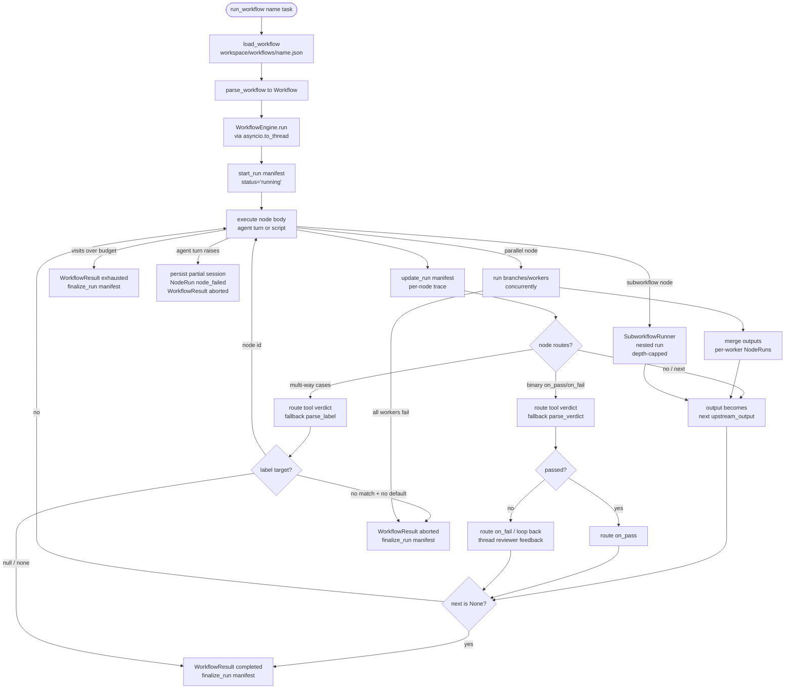

# Workflow engine — User-defined flow graphs

## 1. Purpose

The workflow engine lets a user define a multi-step process as a **flow graph** and
run a task through it. Instead of a single agent turn, a task moves through a graph
of **nodes** the user draws. A node does a piece of the task — a real agent turn with
its own model, tools, and session — and **optionally routes** the
flow (continue, branch, or loop back) on a pass/fail verdict. Routing is opt-in, not a
separate node type. The graph is a plain JSON
document under `<workspace>/workflows/<name>.json`, so it can be authored by a human,
a UI, or an agent; the agent runs one with the `run_workflow` tool.

The engine is **deterministic**: the user's graph drives routing; the LLM does the
work *inside* nodes, it does not decide the path. It runs *above* `AgentRunner` (the
core agent loop is untouched) and reuses the session-lineage primitive, so every
node's work is a persisted, searchable session rather than ephemeral state.

## 2. Mental model

**A workflow is a graph of nodes, not a fixed pipeline.** A `Workflow`
(`durin/workflow/spec.py`) is a set of nodes keyed by id, a `start` node id, and a
per-node visit cap (`max_visits`). A node that does the actual work is one of two
kinds: an agent **work node** (`WorkNode`) — it carries a model (or the default), a
context policy (`own` vs `shared` session), a tool set (`none` vs `default`), a prompt,
optional skills/MCP — or a **script node** (`ScriptNode`) — a deterministic subprocess
run in place of an agent turn (see below). Both carry either a single `next` edge or —
when the node **routes** — a pair of targets (`on_pass`, `on_fail`) or a `cases` map. A
`None`/`null` target ends the run. The parser validates that the start and every edge
target name a real node, and that `next` and routing are not both set.

**Workflow I/O is first-class.** A `Workflow` carries optional `input` (`{text?, file?, description?}`)
and `output` descriptors — rendered as distinct **Input** and **Output** objects on the canvas. The text
input becomes the start node's task; input files are placed in the run's shared working folder, so the
start node (and every later step) reads them there. Multiple input files pair naturally
with dynamic fan-out (a worker per file). The terminal node's text output and the shared working folder are
exposed in the run result. Absent ⇒ today's text-task behavior. The optional free-text `description`
is a lightweight contract: the engine frames every node's task with the input description (what the
run received) and the output description (what it must deliver), so the agents are steered and the
interface is documented — descriptions are hints, not enforced. The output descriptor may
additionally declare **`artifacts`** — a list of `{path, description?}` naming the files (relative
to the run's working folder) the run promises to produce. Declared paths are validated at parse
time (relative, no `..`, no duplicates), ride in every node's framing as the file contract, and
after a completed run the engine reports the ones not produced as `missing_artifacts` on the
result and manifest — a **warning, never a failure** — so an orchestrating caller or a composed
downstream stage learns immediately which promised file is absent instead of failing confusingly
later. However, **provided input files are validated pre-flight** (existence check, distinct basenames) and return an `aborted` result naming any missing or colliding file; and a workflow that declares file input (`file: true`) given none ends the run immediately with a `needs_input` result before any node runs, so the invoking agent asks the user for the files instead of burning node turns.

A caller may also pass a per-run **`output_format`** (the `run_workflow` tool, the run command):
a delivery instruction for THIS call — "a bulleted list", "JSON with fields x,y", "a 3-line
summary" — that overrides the workflow's default output description in the framing, so one
workflow can deliver its result in whatever shape the caller needs without being edited. The
same callers may pass **`input_files`** (absolute paths) — seeded into the run's shared working
folder before the start node runs — and read the terminal **`output_dir`** back from the result;
both the `run_workflow` tool and the HTTP run surface accept files in and report the folder out.
The run result also reports the relative list of files in the shared folder, so the invoking agent
sees what deliverables were produced and where to copy them from.

**A node runs its body, then optionally routes.** `WorkflowEngine.run`
(`durin/workflow/engine.py`) walks the graph from `start`. For an agent node it calls a
`NodeRunner` — by default `AgentNodeRunner` (`durin/workflow/node_runner.py`), which
runs one `AgentRunner` turn with that node's model and tool registry (with
`concurrent_tools` enabled, so a node's independent concurrency-safe tool calls — batch
fetches, parallel reads — run in parallel like the main loop's and subagents'; mutations
stay serial), then persists
the node's conversation as a session keyed `workflow:<run_id>:<node_id>:<iteration>`
with lineage (`origin_type="workflow_node"`). A node is configured independently and
focused by default. Its **work mode** is an `AgentMode` (`durin/agent/agent_mode.py`) —
for nodes, `build` (full access, neutral posture) for steps that create or edit files and
`read` (read-only, neutral posture) for steps that inspect, analyse, or judge; or a
registered custom mode — that sets the node's posture (a prompt suffix) and filters its
tool registry to what the mode allows, so a read-only node literally cannot write
regardless of what the model attempts. The interactive `plan`/`explore` modes also exist
but carry conversation/sub-agent framing (exit_plan_mode, "the parent should /build",
fail-fast-if-modification) that derails a workflow node — e.g. a `verify` gate told it is
a read-only sub-agent that should bail stops emitting its verdict; nodes use the neutral
`build`/`read` instead. Besides the mode, a node carries its model, context and built-in
`tools` — `"default"` loads the `subagent`-scoped background set with a context that
carries `aux_providers` and `app_config`, so memory writes and the vision/audio bridges
register for a node the same way they do for a spawned sub-agent (see
[tools.md](tools.md) for the scope/context gates); the mode then subtracts from that
set — plus the **skills** to inject into its own prompt (loaded the same way the main
agent loads a skill) and the **MCP servers** whose tools it may use — a scoped subset of
the already-configured servers, reused from the gateway's live connections (no per-node
reconnect; the call is marshalled back to the gateway's event loop, where the MCP
session lives). Skills/MCP default empty, so a node sees only what its job needs. The node's output passes along the edge
as the next node's input. A `shared`-context node reads and extends a running
conversation buffer; an `own`-context node is isolated and receives only the upstream
output. **Output travels two channels.** The **text** of a node's output is the edge — it
becomes the next node's input (above). For **files**, every sequential agent node with file
tools shares ONE **working folder** for the run (`<workspace>/.workflow/<run>/work/`,
`durin/workflow/artifacts.py`) — it reads earlier steps' files there and writes its own there.
Because it is one shared folder, created and edited files accumulate in a single place and
each stage (including a loop's re-iterations) sees the prior work, so stages can collaborate
on an evolving fileset (e.g. a debug loop's reproduction test, code, and fix) rather than
hand a copy down a chain. Parallel branches fork the run's working folder along with the
workspace: a writing branch starts from the folder's current files, and its folder writes
reconcile back (choose/union) exactly like workspace writes; read branches and dynamic
fan-out workers are handed the shared folder directly. The `.workflow` tree gitignores
itself and is pruned to recent runs. (Real deliverables a node writes into the workspace
proper are the separate, already-shared filesystem channel.) **When a node routes**, the engine derives a verdict from what the node produced
and follows an edge. A node may route in one of two shapes:

**Binary routing** (`on_pass`/`on_fail`): a routing node ends its own reply with a `PASS`/`FAIL`
line the engine parses (`durin/workflow/verdict.py`) — so a routing node can *verify* (read
the diff, run the tests) before ruling, not just read text. The engine routes to `on_pass` or
`on_fail`; on a fail the node's feedback is threaded into the loop-back so the producer re-runs
knowing what to fix. When the on_fail target has no visits left, the gate is told a FAIL now ends the run (no further revision), so its last verdict is definitive — PASS with noted caveats, or FAIL with a final summary — rather than another loop instruction that can never be acted on.

**Multi-way routing** (`cases`): an agent node declares a set of labeled outcomes
(`{"GROUNDED": null, "MISSING": "plan", "MISUSED": "synthesize"}`). It ends its reply with
exactly one label; the engine matches the last non-empty line of the output against the declared
labels (case-insensitive, surrounding punctuation tolerated), then follows the matching edge.
A `null` target ends the run; any other target is a node id. If the output matches no label the
engine tries a `"default"` key — if that is also absent, the run ends as `aborted` naming the
node and the sorted list of expected labels. Like binary fail-edges, the node's output is
threaded as reviewer feedback before routing to a non-terminal target. The matched label is
recorded in the `NodeRun` trace (`route_label`); `passed` is `None` (pass/fail does not apply).
Binary `on_pass`/`on_fail` is the 2-way special case of this pattern; `cases`, `on_pass`/`on_fail`,
and `next` are mutually exclusive. Routing nodes default to **explore** (read-only) mode.

**A script node runs a deterministic subprocess instead of an agent turn.** A
`ScriptNode` (`durin/workflow/spec.py`) sets exactly one of `command` (inline, run via
`bash -c`) or `script` (a file under `<workspace>/workflows/scripts/`, validated at
parse time to be a relative path with no `..`); the parser rejects any agent-only
field (`model`, `persona`, `context`, `session`, `prompt`, `mode`, `tools`, `skills`,
`mcps`, `max_turns`) on a script node. `ScriptNodeRunner`
(`durin/workflow/script_runner.py`) executes it: a `.py` script runs under the current
interpreter, a `.sh` script under `bash`, anything else must be directly executable (a
shebang); an inline `command` always runs via `bash -c`. **stdin** carries the upstream
edge text — a node at the **start** position (no upstream output yet) receives the
run's task instead, since the run's task is the incoming edge of the start node; an
upstream node that produced an empty string stays empty (no fallback). Small run
metadata rides in `DURIN_TASK`/`DURIN_RUN_ID`/`DURIN_NODE_ID`/`DURIN_ITERATION`/
`DURIN_WORK_DIR` env vars (`DURIN_TASK` is capped — env values have platform size
limits that stdin does not). The rest of the subprocess environment is controlled
by the node's `env` field: `"clean"` (the default) starts from a minimal allowlist
(`PATH`, `HOME`, `USER`, `SHELL`, `LANG`, `LC_ALL`, `LC_CTYPE`, `TERM`, `TMPDIR`,
`DURIN_HOME` — only those present); `"inherit"` is the full gateway process environment, opt-in
per node (see [security.md](security.md)). Neither mode carries stored
secrets — they live in the secret store, not the gateway environment — so a node
that must authenticate declares the names it needs in **`secrets`**: each is
resolved from the store into the subprocess env (the entry's `scope` must allow
the `exec` consumer, the same grant the exec tool honours), validated pre-flight
(an unknown or scope-denied name aborts the run naming the node, before any node
executes), and never able to shadow the `DURIN_*` metadata vars. Both streams are
redacted against the store before becoming edge/feedback text, so a script that
echoes a credential cannot persist it into sessions, manifests, or memory. **cwd** is the
run's shared working folder, so a script reads earlier steps' files and writes
its own the same way a `tools: "default"` work node does. **stdout** (capped
at `workflow.script_output_max_chars`, truncated with a
notice past the cap) becomes the edge text to the next node; **stderr** is
diagnostic-only — never part of the edge text, though a failing binary gate folds a
tail of it into the loop-back feedback (below). Output is decoded with
`errors="replace"` so non-UTF-8 bytes degrade rather than crashing the runner. A script
node has no session — `session_key` is always `None` and it never persists a
conversation.

**Script routing is exit-code-driven, not text-parsed.** A binary script gate
(`on_pass`/`on_fail`) routes on the process exit code: `0` is `PASS` (output = stdout);
non-zero is `FAIL`, and the node's output becomes stdout plus a stderr tail plus an
explicit exit-code note, so the loop-back feedback explains what failed. A multi-way
script node (`cases`) routes on the **last non-empty stdout line**, exactly like an
agent's multi-way output (`parse_label`), but requires a `0` exit — a non-zero exit on
a `cases` node, or on a plain linear node with no routing, is a node failure
(`NodeExecutionError`, aborting the run), not a verdict, since half-produced script
output is not a trustworthy label. A script node's timeout (its own `timeout`, else
`workflow.script_timeout`) kills the whole process group on expiry so orphaned
children die with it, and that too surfaces as a node failure (§4c). **Script nodes are
exempt from the anti-Goodhart guard** below — their verdict is a deterministic exit
code or stdout line, not a model's judgment of its own producer's work, so there is no
structural-identity risk to guard against. A script node also never reads or extends
the shared-context buffer (`context: "shared"` is not a script-node field): inserted
into a chain of `shared` work nodes, it simply passes the buffer through untouched.

**Independence is a graph rule, not a node type:** the
parser rejects a routing agent node that is *structurally identical* (same model, mode,
and prompt) to the producer feeding it, so a quality verdict comes from a genuinely
independent reviewer (the anti-Goodhart guard). A node can also be a **sub-workflow**
(`durin/workflow/subworkflow.py`): it runs another named workflow as a nested run
(reusing the same node and branch-pick runners, bounded by three recursion layers) and uses its output;
the nested run carries the same root session key, so its node sessions anchor to the
invoking conversation too. The three layers are: (1) the editor excludes cycle-creating
targets from the sub-workflow picker, so a cycle cannot be authored in the UI; (2) the
runner maintains a call-stack of workflow names currently executing — if a name is about
to reenter the chain, it stops immediately with a cycle error (`"Error: workflow cycle
detected: A -> B -> A"`) rather than recursing; (3) a `max_depth` counter is the backstop
for deep non-cyclic chains, returning an error at the limit. A sub-workflow runs in the
**parent run's shared working folder** — its nodes read and extend the same fileset as
the parent's sequential nodes (text still travels the edge; files never needed copying).
**A node's "runs as" is a single choice:** either a specific model (or omitted ⇒ default) or
a **Persona** (a named SOUL + its model, mutually exclusive with `model`). Setting `persona`
on a node injects the SOUL body into the node's system prompt and selects the persona's model.
The persona is resolved via `durin/workflow/persona_resolve.py` (shared with the agent loop).

A **parallel** node runs branches concurrently and merges their text outputs into the next
node's input. It has two shapes — **static** (a fixed `branches` list of work-node ids, each
with its own prompt, all seeing the same input) and **dynamic** (a `worker` template node +
`list_from` pointing to the upstream node whose output is parsed as a runtime list: one worker
per item, each getting its own list item as input; the list is emitted by the upstream node as
a JSON array, with a newline-split fallback). **`max_concurrency`** (default 2) bounds both
shapes — at most this many runners execute simultaneously; excess items queue and run in
waves (anti-rate-limit backpressure). Fan-in collects all branch/worker text outputs into the
`next` node's input. For **static** branches, `reconcile` decides how branch *writes* come
back together (`durin/workflow/workspace_fork.py`): `read` = read/analysis branches, no
writes applied; `choose` = each branch writes in a private copy of the workspace and a judge
picks one to apply, discarding the rest; `union` = apply every branch's writes, aborting on a
genuine conflict (two branches wrote *different* content to the same path — identical
incidental files reconcile cleanly). **Dynamic fan-out workers share the workspace** directly
(no per-worker isolation in v1); they hand their output off to the merge node via text, so
`reconcile` has no effect on a dynamic parallel and is not shown in the editor for that mode. A per-node visit count bounds loop-backs across three tiers (the Airflow/Temporal
shape — a config default, a per-unit override, and a hard cap). Each node's budget is
`min(its own max_visits or the workflow's max_visits, workflow.max_node_visits)`: a
per-node `WorkNode.max_visits` overrides the per-workflow `max_visits` (default 3), and
both are clamped by the global config ceiling `workflow.max_node_visits` (default 25, in
settings) — the runaway backstop no node may exceed. Exceeding the budget ends the run
with status `exhausted` carrying `exhausted_node`; the `run_workflow` tool and the editor's
runner surface it gracefully (the node, its last FAIL reason, and the best partial), so the
caller learns it did not complete and why instead of treating a partial as done. The engine hands each work node its effective budget; on a revisit the runner tells the model which pass this is ("Pass X of Y"), and on the last allowed pass says explicitly that no further iteration will happen, so loops converge deliberately instead of being cut off by the cap.

**`max_turns`** (distinct from `max_visits`) caps how many tool-use rounds the model gets
within a single node execution. When set on a `WorkNode`, the node runner (1) prepends a
budget note to the node's system prompt ("You
have up to N rounds of tool use. Gather efficiently, then give your final answer."),
(2) runs the agent with `max_iterations = max_turns` instead of the global default, and
(3) if the run ends because the budget was exhausted, makes a second call with no tools
and `max_iterations=1` asking the model to synthesize from what it gathered — so the node
always produces a real answer rather than a canned "max iterations" message. The second
call's messages are appended to the first run's messages and persisted together. If the
first run completes within budget, no second call is made and the path is byte-for-byte
identical to a node without `max_turns`.

**The engine is decoupled from the LLM and runs loop-safe.** The graph walk depends
only on an injected `NodeRunner` callable, so it is fully unit-testable with a mock.
The real runner drives the async `AgentRunner` synchronously per node, so the
`run_workflow` tool runs the whole (synchronous) engine via `asyncio.to_thread` — the
inner `asyncio.run` then executes in a worker thread with no active event loop, which
is valid even though the tool itself runs inside the agent's async tool loop.

## 3. Diagram

## 4. Run auditability

### 4a. The run manifest

Every run with a workspace produces a durable **run manifest** at
`<workspace>/workflows-runs/<name>/<run_id>.json`. The manifest is a live record, not
a post-run summary:

1. **Before the walk** — `start_run` writes `{status: "running", root_session_key, started_at, runs: []}`.
2. **After each node** — `update_run` rewrites the file with the accumulated per-node trace and `status: "running"`, so an in-flight run is observable by reading the file.
3. **On every exit path** (normal completion, exhaustion, abort, cancellation, or config error) — `finalize_run` writes the terminal status (`completed`/`exhausted`/`aborted`/`cancelled`), `finished_at`, and the full trace.

Each file is keyed by `run_id` and owned by a single writer, so full-file rewrites per update are safe with no RMW lock. Manifest writes are best-effort — a write failure is logged but never interrupts the run.

The per-node entries in the manifest's `runs` array carry:

| Field | Meaning |
|---|---|
| `node_id` | the node's id in the graph |
| `iteration` | how many times this node has executed (loop-back counting) |
| `session_key` | the persisted session containing the node's conversation (`workflow:<run_id>:<node_id>:<iteration>`, with a `:<worker_index>` suffix for fan-out workers; a persistent-session node's key omits the iteration suffix — one session across its passes) |
| `worker_index` | fan-out worker index (0-based; `null` for non-fan-out nodes) |
| `branch_id` | static-parallel branch node id (`null` for non-branch nodes) |
| `status` | `"ok"` / `"persist_failed"` (save raised) / `"node_failed"` (agent turn raised) |
| `passed` | binary routing verdict (`true`/`false`/`null` for non-binary nodes) |
| `route_label` | matched case label for multi-way nodes (`null` otherwise) |
| `budget` | the node's effective visit budget at this pass (`null` for parallel branches/workers, which are not loop targets) |
| `exit_code` | a script node's subprocess exit code (`null` for agent nodes, which have no exit code) |
| `error` | failure detail (stderr tail / exception text, capped) for `node_failed`/`persist_failed` rows — the evidence the improve pass's script-repair lane reads (`null` otherwise) |
| `duration_s` | wall-clock seconds this pass took (`null` where not measured — e.g. choose/union branches) |

The manifest also carries top-level fields. From the very first (`running`) write:
`work_dir` — the run's shared working folder, recorded at start so an in-flight
run's artifacts are findable by any observer (the `tasks` tool renders it plus a
capped listing of the folder's current files). On finalization: `needs_input_node` — the node
that routed to `__needs_input__` (`null` otherwise), the resume re-entry point;
`final_output_node` — which node's output became `final_output` (`null` when no node
contributed, e.g. an aborted run); `output_files`: the relative paths (within the
run's output folder) a completed run produced, empty for a run that ended any other
status or produced no files; `missing_artifacts` — declared `output.artifacts` paths a
completed run did not produce (the warning-only file contract, empty otherwise); and
`parent_run_id` — the calling run's `run_id` when this
run is a nested subworkflow invocation, `None` for a top-level run (including on
manifests written before this field existed).

`read_runs_since` (used by the dream self-improvement pass) returns all records for a
workflow; callers that need only terminal runs should skip records whose `status` is
`"running"` or `"crashed"`.

**Crash reconciliation.** A `running` manifest whose `started_at` is older than a generous
threshold can only be a run whose process died before finalizing. The gateway's startup
sweep (`reconcile_running`) rewrites any such record's status to `"crashed"` (preserving
its partial trace) so an auditor sees a truthful status rather than a permanently stale
`running`. The threshold is deliberately generous; real runs finalize fast.

**Retention.** `prune_manifests(workspace, name, keep=workflow.keep_runs)` bounds how
many manifests accumulate per workflow name: after each successful `finalize_run`, the
engine deletes the oldest *terminal* records (completed/exhausted/aborted/cancelled/crashed)
beyond `keep`, run best-effort and never fatal to the run. A `running` manifest, or a
`needs_input` manifest carrying its `needs_input_node`, is never deleted and never counts
against `keep` — a running record is live, and a resumable needs_input manifest is the
pause point a caller may still act on (the deliberate consequence: resumable records that
are never resumed accumulate outside the retention bound until acted on). A `needs_input`
manifest WITHOUT a re-entry node — written before resume existed — is not resumable (the
resume endpoints reject it) and retains like any terminal record, so legacy pauses cannot
accumulate as unactionable ghosts; the runs UI likewise counts only resumable pauses in
its stranded tray and badge. Malformed or unreadable files are skipped, never deleted. A nested subworkflow run prunes its own
(child workflow name's) manifest store independently of its parent's, since manifests
are keyed per workflow name. Because pruning is intentionally decoupled from the dream
pass's read cursor (coupling them would let a disabled dream block pruning forever), a
terminal run the dream has not yet consumed can be pruned before it is read — the dream
pass tolerates the resulting gap and simply sees fewer records.

### 4b. The session invariant

The engine never shares the calling session with a node. Every unit of work — every
agent node, every fan-out worker, every static branch — runs in its own fresh session
keyed `workflow:<run_id>:<node_id>:<iteration>` (plus `:<worker_index>` for fan-out
workers), with exactly one recorded parent. A node may opt into a persistent session
(`"session": "persistent"`): its visits share ONE session keyed
`workflow:<run_id>:<node_id>` — when a loop returns to it, the node resumes its own
conversation (its prior reasoning, decisions, and file knowledge) and receives only the
new input (loop feedback + the pass counter) as a revisit turn. Parallel units cannot be
persistent, and persistent excludes `context="shared"` (two competing continuity
mechanisms).

**Reverse lineage** (child → parent): each node session carries a `parent_session_id`
pointing to the calling session. **Forward reference** (caller → node sessions): the
run manifest records each node's `session_key`, so you can reach every session a run
produced directly from the manifest.

**No orphan sessions.** Service and cron runs have no calling session. Rather than
letting each node session self-root (producing orphans that `children_of` cannot
find), the engine synthesizes a per-run root: all node sessions of a headless run share
`parent_session_id = workflow:<run_id>:root`. That stub session (`origin_type="workflow_run"`) is
created once on first use, so `children_of("workflow:<run_id>:root")` returns every
node session of the run. The manifest's `root_session_key` records the same key, so
`runs_for_session` can find the run from either the calling session or the synthetic root.

### 4c. The failure model

**Failed node.** When a node's agent turn raises (provider/MCP/tool error), the node
runner persists whatever conversation messages existed under the node's session key with
status `node_failed`, then raises a typed `NodeExecutionError` carrying the `node_id`,
`iteration`, and persisted `session_key`. The engine catches this, appends a
`NodeRun(status="node_failed", session_key=..., error=...)` to the trace (so the
manifest captures it), then returns a `WorkflowResult(status="aborted")` that names the
failing node (`failed_node`, `failed_iteration`). The failed node's session remains
navigable in full.

**Script node failures.** A script node has no agent turn to raise, but two of its own
failure paths land on the same `NodeExecutionError` → `node_failed` path as an agent
node: a non-zero exit from a linear or multi-way (`cases`) script (a binary gate's
non-zero exit is a `FAIL` verdict instead, not a failure — see §2 and §4d), and a
timeout (the process group is killed and reaped before the error is raised). Both
record a `node_failed` `NodeRun` with no `session_key` (a script node has no session)
and abort the run the same way an agent node's failure does. The non-zero-exit path
also carries the subprocess's `exit_code` into that `NodeRun` (a timeout has none —
the process never returned one).

**Missing script file.** When a `ScriptNode` names a `script` file, its existence is
checked in the same pre-flight pass as input-file validation (§2), before any node
runs or any manifest exists — a missing file aborts the run naming the node and the
expected path, never reaching the walk.

**Parallel node failure isolation.** For dynamic fan-out workers and `read`-reconcile
static branches, a single worker/branch failure is isolated: the failing unit records
its own `node_failed` NodeRun (with its `session_key` and `error`), surviving units
complete normally, and their outputs are merged (failed units appear as `FAILED: …` in
the merged output). The run is only aborted when every unit failed. **`choose` and
`union` reconcile are deliberately not isolated**: these branches write to private
workspace forks and a half-failed fork has no coherent state to merge, so a branch
failure in those modes propagates and aborts the run.

`NodeRun.status` values: `"ok"` (node persisted), `"persist_failed"` (session save raised
but the run continued), `"node_failed"` (the node's agent turn raised).

### 4d. The routing verdict — a forced tool call, text-parse as fallback

This section covers **agent** routing nodes. A script node's verdict is derived
directly from its exit code or last stdout line (§2) — there is no LLM call and no
text-parse fallback involved.

A routing node's verdict is **deterministic by construction**. After the node's work turn,
the node runner makes one **forced `route` tool call** (`tool_choice="required"`) whose
`label` parameter is an **enum of that node's own labels** — the `cases` keys for a multi-way
node, or `PASS`/`FAIL` for a binary one. The model can only return a value from that enum, so
the verdict is always a valid label instead of a fragile free-text line that a stray word can
derail. The call runs as a separate `provider.chat` (the runner reaches the provider via
`AgentRunner.provider`) with the node's full conversation as context, and is wrapped so **any
failure yields no label** (`route_label=None`) — the run never breaks on it.

When the tool call did not produce a valid label — it errored, or the provider did not honour
the forced call — the engine **falls back to parsing the node's text output**:

- **`parse_verdict` (binary)** reads the **first non-empty line** and returns `True` iff it
  starts with `PASS` (case-insensitive). Default is `False` (FAIL) — an empty or unparseable
  answer loops back, never silently passes.
- **`parse_label` (multi-way)** scans lines **from the end** for one whose full stripped,
  de-punctuated text equals a declared case label (case-insensitive); it returns the **last**
  match.

**Practical implication (fallback path only):** the tool call makes label placement in the
text irrelevant in the normal case. It still matters when the fallback runs — a binary node's
`PASS`/`FAIL` should be its first line, a multi-way label its last — so a verdict still
survives if the forced tool call is ever unavailable.

**Terminal routing output.** When a routing node ends the run (its followed edge is null), its output minus the verdict/label line becomes the run's final output when non-empty; a bare-verdict gate leaves the previous node's output in place. A terminal gate that produced real content (a verification summary, a final synthesis) is therefore not silently discarded.

### 4e. Context vs. session

`context` controls what a node **sees**, not where its work is stored.

- **`own` (default):** the node receives only the upstream edge output as its user
  message. Its work is always its own fresh session regardless.
- **`shared`:** the node additionally receives a running buffer of all preceding
  `shared` nodes' conversation turns as extra context before its user message, and its
  own turns are appended to that buffer for subsequent `shared` nodes. The buffer is
  capped to bound prompt growth on long shared chains. The buffer carries each shared
  node's own turns only — never its system prompt nor the context it inherited — so a
  chain of shared nodes cannot re-accumulate (duplicate) earlier context.

**`shared` is sequential-only.** Parallel workers are always isolated (each gets its
own session; there is no shared buffer across concurrent threads), and only their text
outputs are merged (`[0] … [1] …`). A routing node may not use `context="shared"`;
the spec rejects that combination at parse time because a routing node reads its own
output to derive a verdict, not the shared buffer.

A node may opt into a persistent session (`"session": "persistent"`): its visits share
ONE session keyed `workflow:<run_id>:<node_id>` — when a loop returns to it, the node
resumes its own conversation (its prior reasoning, decisions, and file knowledge) and
receives only the new input (loop feedback + the pass counter) as a revisit turn.
Parallel units cannot be persistent, and persistent excludes `context="shared"` (two
competing continuity mechanisms).

### 4f. HTTP surface for run data

The `WorkflowsService` exposes read routes for run manifests:

| Route | What it returns |
|---|---|
| `GET /api/v1/workflows/{name}/runs?limit=` | that workflow's persisted run summaries (`run_id`, `status`, `started_at`, `finished_at`, `task` capped at 200 chars, `needs_input_node`, `parent_run_id`), newest-first, capped at `limit` (default 20) |
| `GET /api/v1/workflows/{name}/runs/{run_id}` | one run's manifest (live or terminal) |
| `GET /api/v1/workflows/runs?session=<key>` | all run manifests whose `root_session_key` matches, newest-first |
| `GET /api/v1/workflows/runs?limit=` (no `session`) | the global feed across every workflow, newest-first, capped at `limit` (default 50) — except `needs_input` entries, which are always included regardless of the cap since they are actionable resume points |

The `POST /api/v1/workflows/{name}/run` request accepts an optional `resume_run_id`:
the run_id of a prior run of the same workflow that ended `needs_input`, with `task`
carrying the user's answers. The response carries `run_id`, a per-node trace with
`session_key`, `worker_index`, `branch_id`, `budget`, `status`, and `route_label` for
each entry, plus `final_output_node` (which node's output became `final_output`),
`needs_input_node` (the node that asked, when the run ends `needs_input`) and
`output_files` (relative paths in `output_dir`, for a completed run).

### 4g. Background mode and live progress

**Background mode.** `run_workflow` runs in the background by default — the
engine launches the walk in a detached task and returns immediately, so the
calling agent continues its turn while the workflow runs concurrently. The agent
passes `background=false` only when it needs the result in the same turn. When
the walk finishes, its result (or a `needs_input` status carrying the gate's
questions) is injected back into the calling session via `session_key_override`,
using the same announce path as a completing sub-agent, so the calling agent can
act on the outcome without polling. The injected summary is capped (with a
pointer to `tasks(action='status')` for the rest) so an unbounded final output
cannot drown the delivery turn, and the delivery turn announces itself with a
progress breadcrumb ("Processing background workflow result…") so the chat's
stop button has visible context while the agent digests the result. The `background` flag applies only to
`run_workflow` invocations from inside an agent turn; the HTTP
`POST /api/v1/workflows/{name}/run` surface is always synchronous.

The waiting contract is push, not poll: because the result is injected on
completion, the launching agent is told (in the launch reply, the tool
descriptions, and the `workflows` skill) to report the run to the user and END
its turn rather than burn it on sleep+status loops — the follow-up wakes it,
and the user watches live per-node progress in the Work panel. A deterministic
backstop reinforces the guidance: a `sleep` that wakes while this session still
has running background work appends a reminder naming those tasks and telling
the agent to end its turn, so a polling loop is corrected on its first
iteration instead of running for minutes. A background
launch still returns the run's `run_id` (pre-generated and passed to the
engine as its `run_id_factory`) so the agent can observe or cancel the run
on demand through the unified `tasks` tool — `tasks(action='status', id=…)`
reads the run manifest (rendering the run's `work_dir`, each node's latest-pass
`duration_s`, and a capped listing of the working folder's current files — the
mid-run window onto a run's artifacts), `tasks(action='stop', id=…)` requests
cancellation. The same merge of
sub-agents and workflow runs that backs `GET /api/v1/tasks`
(`durin/agent/background_tasks.py`) is what `tasks` renders. For a run that
ends `needs_input`, this same surface carries the gate's questions so panels
(like the web UI's Work panel) can show what is being asked.

**Resuming a needs_input run.** A run that ended needs_input can be resumed
instead of restarted: the engine re-enters the graph AT the asking node, with
the same run_id (same shared working folder, same node-session keys), the
visit counts already consumed, and the user's answers as that node's upstream
input. The shared-context buffer is not reconstructed across a resume —
persistent-session nodes recover their own history, and files live in the
working folder.

**Cooperative cancellation.** `tasks(action='stop', …)` marks the `run_id` in a
process-global registry (`durin/workflow/cancellation.py`); the engine polls it
via a `cancel_check` callback at the top of its node walk. For an agent node a
cancel takes effect **between** nodes — a node already executing finishes first
(best-effort, the same contract as cancelling a sub-agent). A script node gets
the same callback threaded into its subprocess wait, polled every slice while
the process runs: a cancel there kills the subprocess's process group directly
(the same group-kill path a timeout uses) instead of waiting for it to finish
or time out. Either way the run ends with the terminal status `cancelled`,
carrying the partial per-node trace, and its result is still injected back
like any other completion. A **foreground** run
(`background=false`) is bridged to the same mechanism: if `/stop` cancels the
turn awaiting it, `run_workflow` signals the run's cooperative flag — asyncio
cancellation cannot reach the engine's worker thread — so the engine stops
before its next node instead of running to completion unobserved, and the flag
is dropped once the detached engine actually stops.

**Live per-node and per-branch progress.** The engine emits a progress frame at
the start of each node (status `running`) and another when the node finishes.
For parallel nodes, each branch (static or dynamic fan-out worker) emits its own
start and finish frames independently, so the work panel can show branch-level
progress live as branches complete at different times. Because the graph walk
executes on a worker thread (`asyncio.to_thread`), frames are marshalled back to
the gateway's event loop via
`asyncio.run_coroutine_threadsafe(bus.publish_outbound(...), main_loop)` before
being published on the message bus. The WebSocket channel propagates them as
`tool_events` frames that the work panel consumes in real time. Each node entry
in a frame also carries its `iteration` (current pass number) and `budget`
(effective visit limit, `null` where not applicable) so the panels can render
loop progress live, not just after the run completes.

The **terminal frame** (built by the tool after the run, not by the engine)
additionally carries the run-level `status` (`completed` / `needs_input` /
`exhausted` / …). For a `needs_input` run the node that asked is marked
`needs_input` (only its last run row — earlier rows are completed loop
iterations) and the questions ride in a capped `detail` field, so push-fed
panels (the TUI sidebar) can show a paused run and what it is waiting for
without polling the tasks API or reading the manifest.

**The web UI's Runs pane** (a top-level pane inside the Workflows section,
alongside the editor) reads the global feed (§4f) to show every run across all
origins (sessions, HTTP, cron, editor) in one place, with a tray of stranded
`needs_input` runs on top — each with its questions and a direct resume form —
so a paused run started from any surface can be found and answered without
knowing which session or workflow it came from. The sidebar's Workflows button
carries a badge with the stranded-run count so it stays visible from any view.

## 5. How it works

End-to-end for a single `run_workflow` call:

1. **Load.** `RunWorkflowTool.execute` (`durin/agent/tools/run_workflow.py`) loads the
   named definition with `load_workflow` (`durin/workflow/loader.py`), which reads
   `<workspace>/workflows/<name>.json` and parses it with `parse_workflow`. A missing
   file returns an error string (it does not raise).
2. **Wire.** It resolves the user's default model preset
   (`DurinConfig.resolve_default_preset`), builds the provider (`make_provider`), and
   wires `AgentRunner` → `AgentNodeRunner` (passing the user's real `cfg.tools`), a
   `ScriptNodeRunner` (for script nodes), an `AgentJudgeRunner` (used only to **pick** a
   winner for parallel `choose`), and a `SubworkflowRunner` (for sub-workflow nodes)
   into the `WorkflowEngine`.
3. **Run.** The engine runs under `asyncio.to_thread`. It walks the graph: an agent node
   runs its body as an agent turn (persisting a lineage'd node session), a script node
   runs its `command`/`script` as a subprocess via the `ScriptNodeRunner` instead (no
   session), and either way the output threads to the next node; a **routing** node
   branches on a `PASS`/`FAIL` verdict — from the agent's own output for a work node, or
   the subprocess exit code for a script node (threading the feedback into the loop-back
   on fail); a sub-workflow node runs a nested workflow; a failed gate loops back,
   re-running the target node as the next iteration (a sibling node session for a work
   node), capped by `max_visits`.
4. **Return.** The run produces a typed `WorkflowResult` (status + final output +
   per-node trace, including each node's `session_key`). The engine finalizes the run
   manifest before returning; neither the tool nor the service writes an additional
   record. The tool formats the result into a short summary (each node's session key is
   included for agent and routing nodes). The node sessions persist on disk, so the
   run's work is navigable, searchable, and visible to the dream memory passes — the
   same way subagent and cron per-run sessions are (see [cron.md](cron.md),
   [memory/00_overview.md](memory/00_overview.md)). See §4 for how to navigate the run
   from its manifest.

## 6. Key types & entry points

| Symbol | File | Role |
|---|---|---|
| `Workflow`, `WorkNode`, `ScriptNode`, `SubworkflowNode`, `ParallelNode`, `parse_workflow` | `durin/workflow/spec.py` | The flow-graph definition and its JSON parser/validator (agent work nodes and deterministic script nodes; routing optional; structural-equivalence guard). |
| `parse_verdict`, `parse_label` | `durin/workflow/verdict.py` | The verdict contracts: `parse_verdict` returns the binary `PASS`/`FAIL` from a routing agent node's output (default `FAIL`); `parse_label` matches the last non-empty line of a multi-way node's output against the declared case labels (case-insensitive, punctuation-tolerant). They are the text-parse **fallback** used when the forced `route` tool call did not return a label. |
| `artifact_dir`, `prune_runs` | `durin/workflow/artifacts.py` | The run's shared working folder (one per run; every sequential node reads/writes it) plus per-branch fork folders for writing-in-parallel — self-gitignored, pruned to recent runs. |
| `AgentJudgeRunner` | `durin/workflow/judge.py` | The branch-pick reviewer: `pick` chooses the best of N outputs for a parallel `choose` reconcile. |
| `fork`, `diff`, `conflicts`, `apply` | `durin/workflow/workspace_fork.py` | Per-branch workspace isolation + reconciliation (choose/union) for writing-in-parallel. |
| `WorkflowVersionStore` | `durin/workflow/version_store.py` | Git versioning of workflow definitions: each run snapshots them; `history` reads the timeline. |
| `SubworkflowRunner` | `durin/workflow/subworkflow.py` | Runs a named workflow as a nested run (depth-capped) for a sub-workflow node. |
| `WorkflowEngine` | `durin/workflow/engine.py` | The graph executor: routing, loop-back with a visit cap, own/shared context, output threading, and concurrent parallel branches. |
| `AgentNodeRunner` | `durin/workflow/node_runner.py` | The default node runner: one real `AgentRunner` turn per agent node (adds a verdict instruction when the node routes), persisted as a lineage'd node session. |
| `ScriptNodeRunner` | `durin/workflow/script_runner.py` | The script-node runner: runs the node's `command`/`script` as a subprocess in the run's working folder (stdin = upstream edge text, capped stdout = edge text, stderr diagnostic-only), timeout-bounded with a process-group kill on expiry, exit code (or last stdout line for `cases`) drives routing. |
| `seed_workflows` | `durin/utils/helpers.py` | Copy bundled seed JSONs into a workspace's `workflows/` dir (idempotent, called from `sync_workspace_templates`). |
| `load_workflow` | `durin/workflow/loader.py` | Load and parse a workflow by name from the workspace. |
| `WorkflowResult`, `NodeRun` | `durin/workflow/result.py` | The typed run outcome and per-node trace. |
| `RunWorkflowTool` | `durin/agent/tools/run_workflow.py` | The `run_workflow` LLM tool (core scope) that loads, runs, summarizes a workflow, and records its run. |
| `ListWorkflowsTool` | `durin/agent/tools/list_workflows.py` | The `list_workflows` LLM tool (core scope, read-only) that lists the workspace's workflows with their `description` and I/O for discovery; an optional `query` filters by name/description. |
| `WorkflowWriteTool` | `durin/agent/tools/workflow_write.py` | The `workflow_write` LLM tool (core scope): validates a definition via `parse_workflow` before persisting, refuses overwriting an existing name, defaults `improvement_mode` to `manual`, and commits through the version store. The agent's sanctioned authoring path (also given to the dream's skill-extract sub-agent, so a skill can delegate to a workflow it authored). |
| `start_run`, `update_run`, `finalize_run`, `read_manifest`, `runs_for_session`, `reconcile_running`, `read_runs_since` | `durin/workflow/run_log.py` | The live run manifest (running→terminal), per-run diagnostic records, crash reconciliation, and the self-improvement signal source. `read_runs_since` callers that need terminal runs should skip records with `status in {"running","crashed"}`. |
| `NodeExecutionError` | `durin/workflow/engine.py` | Typed error raised by the node runner when an agent turn or a script node's process fails or times out; carries `node_id`, `iteration`, and `session_key` (`None` for a script node) so the engine can record an attributable `NodeRun` before aborting. |
| `compute_diagnostics` | `durin/workflow/diagnostics.py` | Reduces run records to recurring per-node trouble (loop-backs, gate fails, script failures with sample error strings) → improvement candidates. |
| `run_workflow_improve_pass` | `durin/workflow/workflow_improve_dream.py` | The dream pass: observes all workflows' runs since its cursor, proposes one edit — a node's `prompt`, a script node's `command`, or a `script_file`'s content, the latter two gated by recurring failure evidence and a deterministic pre-apply check; manual (or `manual_only`) → recommend, auto → apply + hold pending validation (auto-revert on a worsened diagnostic), out-of-scope → structural escalation. |
| `save_workflow_definition` | `durin/workflow/editing.py` | The single sanctioned write path for definitions: graph validation, atomic write under the editor's lock, version commit with actor. All doors funnel through it. |
| `WorkflowEditTool` | `durin/agent/tools/workflow_edit.py` | The `workflow_edit` LLM tool (core scope): full-definition edit of an EXISTING workflow by the in-session agent; refuses a missing name. |
| `log_recommendation`, `log_script_file_recommendation`, `open_recommendations`, `apply_recommendation`, `dismiss_recommendation`, `log_structural_suggestion`, `mark_reverted` | `durin/workflow/workflow_recommendations.py` | The per-workflow recommendation queue: prompt / command / script_file edits (open → applied / dismissed / reverted, `manual_only` flagged) and annotated structural escalations; `apply_recommendation` re-runs the script pre-apply gate for `command`/`script_file` kinds before writing. |

## 7. Configuration & surfaces

- **Definitions** live as JSON under `<workspace>/workflows/<name>.json`. That
  directory is a small local git repo (`durin/workflow/version_store.py`, via the
  shared `GitRepo`); every run snapshots the current definitions, so there is a
  navigable version history of how each workflow changed and which version a run used.
  A script node's referenced files live under `<workspace>/workflows/scripts/`, inside
  that same tree, so they are versioned alongside the definitions that reference them.
- **Discovery:** an optional top-level workflow `description` (one line — what it does and
  when to use it) is the discovery hint, surfaced by the `list_workflows` LLM tool —
  auto-discovered into the agent's tool registry at core scope, read-only. It lists the
  workspace's local workflows (name, `description`, and I/O), with an optional `query` that
  filters by name/description, so the agent can pick which one to run; `run_workflow` runs it.
  The field is optional and backward-compatible — a workflow without it parses and runs fine.
- **Surface:** the `run_workflow(name, task, output_format?, input_files?, background?,
  resume_run_id?)` LLM tool — auto-discovered into the agent's tool registry at core scope
  (see [tools.md](tools.md)). `input_files` (absolute paths) are seeded into the run's shared
  working folder so every node can read them, and the terminal `output_dir` is reported back
  in the run summary. When a run ends `needs_input`, calling the tool again with
  `resume_run_id` set to that run's id and the user's answers as `task` resumes the same run
  (same run id, working folder, node sessions, and visit counts) at the node that asked,
  instead of restarting the workflow from scratch. A node with
  `tools: "default"` receives the user's configured tool set; `tools: "none"` (the
  default) runs the node without tools. A node may also name `skills` (injected into
  its prompt) and `mcps` (a subset of the configured MCP servers, reused live).
- **Engine settings:** `workflow.max_node_visits` (default 25) and `workflow.keep_runs` (default 20)
  control global defaults. `max_node_visits` caps how many times any node can iterate (a safety
  ceiling on visit budgets declared per-node). `keep_runs` bounds, per workflow name, both how many
  runs' working folders (`.workflow/<run_id>/`) are retained on disk and how many terminal run
  manifests are kept (see §4a Retention) — older ones are pruned automatically, so deliverables
  that must outlive retention should be copied to the workspace proper or elsewhere.
  `workflow.script_timeout` (default 300s) is the default per-node timeout for a script
  node (a node's own `timeout` overrides it); `workflow.script_output_max_chars`
  (default 16000) caps a script node's captured stdout — the edge text it passes on
  (excess is truncated with a notice).
- **Management API:** `WorkflowsService` (`durin/service/workflows.py`) exposes, over HTTP
  at `/api/v1/workflows[/{name}]` and in the OpenAPI contract: list / load / save / delete
  (save validates via `parse_workflow` and writes atomically under the version lock — the
  same lock target the version store snapshots under, beside the dir, so a write and a
  snapshot never interleave); **duplicate** (`…/{name}/duplicate` — copy a definition to a
  new name to use as a starting point); **run** (`…/{name}/run` — executes the workflow on a task and
  returns the per-node trace); the **recommendations** queue (`…/recommendations`,
  `…/recommendations/{id}/apply`, `…/recommendations/{id}/dismiss`); and `GET
  /api/v1/workflows/scripts`, which lists the filenames under
  `<workspace>/workflows/scripts/` available to script nodes (empty when the
  directory is absent) — the source for the visual editor's script-file picker.
  `GET /api/v1/workflows/scripts/{name}` and `PUT /api/v1/workflows/scripts/{name}`
  (body `{content}`) read and create-or-replace one script file — the editor's
  file-mode "New script…" and "Edit" actions — with the same containment rule as
  the parser (single relative filename, no `..`), a 256 KB content cap, an atomic
  write, and a best-effort version-store snapshot. This is the surface the webui
  visual editor uses.
- **Lineage:** node sessions reuse the lineage metadata on the open session document
  (`durin/session/lineage.py`), so no schema migration is involved.
- **Self-improvement** (per-workflow `improvement_mode`, two states like a skill's:
  `manual` default / `auto` — the same contract as skills: auto lets the dream act,
  manual routes everything to the user). Each run writes a diagnostic record
  (`run_log.py`, beside `workflows/`) whose per-node trace includes a script node's
  `node_failed` rows (crash, timeout, non-zero exit outside a binary gate) with the
  failure detail. A dream pass (`run_workflow_improve_pass`, wired into the
  `memory_dream` cron) reduces the runs since its per-workflow cursor to recurring
  trouble — a node that loops, a gate that keeps failing, a script node that keeps
  raising (`diagnostics.py`: `loop_backs` / `gate_fails` / `script_failures`, plus up
  to three `failure_samples` per script node) — shows a model the definition + that
  diagnostic + the change history (so it never re-proposes a reverted edit), and
  produces one scoped proposal in one of three shapes:
  - a node's `prompt` (work nodes and routing nodes both use `prompt` as their
    editable field) — unrestricted, the original lane.
  - a script node's inline `command` — only for a node whose recurring
    `script_failures` count meets the evidence floor (`RECURRENCE_FLOOR`, same floor
    as every other diagnostic candidate). A gate-fail count alone is never evidence
    for a script edit — that trouble keeps routing to the producer's prompt instead
    (the anti-Goodhart anchor: the dream must never "improve" a workflow by weakening
    a check).
  - a `script_file`'s full new content — only for a file under
    `<workspace>/workflows/scripts/` referenced by a node with that same evidence.
    The repair lane only edits single-segment filenames: a nested reference (e.g.
    `sub/tool.sh`) is left alone even when it is the one failing.

  A script proposal on a node that **routes** (`on_pass`/`on_fail` or `cases` — a
  gate), or a `script_file` referenced by any routing node, is always `manual_only`:
  it is recorded as a recommendation and never auto-applied, even in
  `improvement_mode: auto` — a person always reviews a gate edit.
  `<workspace>/workflows/scripts/` is a namespace shared by every workflow in the
  workspace, not scoped to the one proposing the edit: a `script_file` target is also
  forced `manual_only` when a node in ANY OTHER workflow references that same file —
  routing or not — since that sibling's damage would be invisible to this workflow's
  own pending-validation window. A sibling definition that fails to parse fails safe
  instead of being skipped: its raw JSON is substring-scanned for the filename, so a
  broken-but-later-repaired sibling can never read as "not referenced".

  Before an in-scope script proposal is even queued — and again, independently, at
  the moment it is actually written (whether that write is the dream's own auto-apply
  or a user clicking Apply on a manual recommendation) — it must pass the
  deterministic pre-apply gate (`script_precheck.py::precheck_script_edit`): syntax
  (`bash -n` / `py_compile`), a security scan (the same skill scanner that gates
  dream-bundled skill scripts), and a smoke run (empty stdin, a scratch cwd, the
  clean env allowlist regardless of the node's own `env` mode, a short timeout —
  fails only on a startup-crash signature, not a plain non-zero exit, since a gate
  legitimately exiting 1 on empty input is healthy). The smoke run is the only one
  of the three that executes the proposed code, so it only runs at QUEUE time when
  the proposal could land without a person acting (`improvement_mode: auto` and not
  `manual_only`) — a manual-mode or `manual_only` proposal gets syntax + security
  scan only at queue time, and the smoke run happens later, at APPLY time, where a
  user's own Apply click is the consent for that execution. The apply-time re-run
  always runs the full gate, smoke included. The gate fails closed at every
  step (a scanner crash, unscannable content with no recognized extension or shebang,
  etc. all count as a failure, never a free pass). A failing check is never silently
  dropped: it lands as a `kind: structural` recommendation with the check's own
  output as `why_rejected`; a failure at the apply-time re-run instead leaves the
  recommendation `open` so the user sees why nothing happened.

  A proposal has three dispositions:
  - **manual** → recorded as a recommendation (`workflow_recommendations.py`:
    `log_recommendation` for prompt/command, `log_script_file_recommendation` for a
    file); the user reviews it in the webui Workflows banner or the `durin workflow`
    CLI and applies or dismisses. Applying a prompt/command writes the field through
    the shared editing engine and versions it; applying a `script_file` writes the
    file atomically and snapshots it into the same version history. The anti-Goodhart
    anchor is the human.
  - **auto** (and not `manual_only`) → the pass applies it itself through the SAME
    apply path (`apply_recommendation(actor="dream")`), then holds it **pending
    validation**: on the workflow's next terminal runs, if the edited target's
    trouble rate (loop-backs + gate fails + script failures per run; for a
    `script_file`, the MAX rate across every node that runs it) worsened vs the
    pre-edit baseline, the pass restores the previous state, branching on kind — a
    `prompt`/`command` through the definition path (same as a manual apply), a
    `script_file` by writing back its exact previous bytes atomically under the
    version lock plus a version snapshot — marks the recommendation `reverted` (its
    dedup id pins any identical re-proposal), and emits `workflow.improve.reverted`.
    Validated-or-equal clears the marker. The baseline and the "previous" value it
    can restore both come from `apply_recommendation`'s own pre-write read, not an
    earlier one the pass took — closing a race where a concurrent editor save during
    the multi-second precheck would otherwise leave the revert target stale.
  - **structural** (out of the editable scope — add/remove nodes, rewire, other
    fields, a script edit with no recurring failure evidence, or one that failed the
    pre-apply gate): never applied in ANY mode; recorded annotated (the model's full
    proposal, why the scope refused it, the diagnostic evidence) as a `kind:
    structural` recommendation. The webui renders it as an escalation card with a
    copy-for-chat action so the user can treat it in a session; `apply` refuses it in
    code.

  Every prompt/command write lands through
  `durin/workflow/editing.py::save_workflow_definition` — the single sanctioned path
  for a definition (`workflow_write` create / `workflow_edit` full-definition edit by
  the in-session agent / recommendation applies): graph validation, atomic write
  under the editor's lock, version-store commit with its actor. A `script_file` write
  instead lands directly under `workflows/scripts/` (atomic write + version
  snapshot, serialized on the same version lock) — the dream never gets the
  full-definition editor. Telemetry: `workflow.improve.recommended` / `.applied` /
  `.reverted` / `.structural`, each carrying a `kind` (`prompt` | `command` |
  `script_file`) (catalogued in `durin/telemetry/schema.py`).
- **Seeds.** Starter workflows ship bundled under `durin/templates/workflows/` and
  are copied into a fresh workspace's `workflows/` directory by
  `seed_workflows(workspace)` (called from `sync_workspace_templates`) — idempotent,
  never overwrites a user-edited file.

  | Seed | Pattern |
  |---|---|
  | `research-to-answer` | plan → dynamic fan-out (search × N) → synthesize → verify, a **tolerant** per-claim grounding gate (multi-way: GROUNDED ends — a summary intro and minor gaps are acceptable / MISSING → re-plan / MISUSED → re-synthesize) |
  | `brainstorming` | clarify gate (routes `NEED_INFO` to the reserved `__needs_input__` terminal → asks the caller for info) → frame angles → parallel explore → synthesize a design **spec** |
  | `writing-plans` | intake gate (`__needs_input__` on a thin brief) → draft a step-by-step plan → parallel critique (gaps / risks / verifiability / scope) → revise → a tolerant verifiability gate (GAPS loops back) → a `/build`-ready plan with a `## Verification` section |
  | `build-specs` | intake gate (`__needs_input__` on an underspecified slice) → frame the independent components (also writes `components.json`) → dynamic fan-out (a detailed spec per component) → assemble one handoff spec → a deterministic **script** coverage gate (exit 0 = every component name present in the assembled spec; a miss loops back to assemble with the missing names as feedback) |
  | `execute-plan` | intake gate (critically reviews the plan; `__needs_input__` on a blocking gap) → implement (build, **self-loop** on `MORE`/`DONE`, one plan step per turn; `BLOCKED` → `__needs_input__` when it cannot proceed rather than guessing or exhausting) → review; the shared working folder lets each step build on the last (subagent-driven execution of a plan) |
  | `debug` | reproduce a failing check → diagnose the root cause → fix in place → verify gate (`PASS` ends / `FAIL` loops back to diagnose); the steps collaborate on the shared working folder (reproduction, code, and fix together) |
  | `review-changes` | frame the review lenses that matter for this diff → dynamic fan-out (one reviewer per lens) → synthesize a severity-grouped review |

  Each is a deliberately small, live-verified exemplar. The first three are knowledge work
  (orchestrator-workers + evaluator-optimizer + the consultative `needs_input` shape); the
  rest are development workflows, and `execute-plan`/`debug` exercise the shared working
  folder where stages collaborate on one evolving fileset. More seeds are added one
  trustworthy example at a time, never as stubs.

- **Current scope.** Today: sequential execution with **concurrent parallel** branches —
  static (fixed `branches` list) or **dynamic** (`worker` template mapped over a runtime
  list, bounded by `max_concurrency` default 2) — only an agent work node may serve as a
  branch or the fan-out worker template; a script node is rejected there (the parser
  requires `WorkNode`), since a script already does its own iteration/parallelism
  internally and wrapping it in the engine's fan-out would be redundant; read-only or **writing** with `choose` /
  `union` reconciliation (private copy per branch + content-aware conflict detection); a
  **shared working folder** per run that sequential nodes read and write, so file-producing
  stages collaborate on one evolving fileset (and a self-loop accumulates) instead of handing
  copies down a chain — parallel branches fork it the same way (writing branches seed from
  the current files and reconcile back, read branches and dynamic workers share it directly);
  per-node **work mode** (`build`/`read` neutral postures for nodes; `plan`/`explore` carry interactive framing) / **model or persona** (SOUL + model,
  mutually exclusive) / context / tools; **optional routing** in two shapes — **binary**
  (`on_pass`/`on_fail`: a `PASS`/`FAIL` verdict from the agent — or, on a script node,
  from the exit code — feedback-threaded loop-back)
  and **multi-way** (`cases`: one of N declared labels from the agent — or, on a script
  node, from the last stdout line — last-line match, `default` fallback, aborts clearly
  when no label matched), with an anti-Goodhart guard
  that a routing node not be structurally identical to its producer; a terminal routing node's
  own output (minus its verdict/label line) becomes the run's final output when non-empty, so a
  gate that produces real content is not silently discarded; a multi-way case may
  route to the reserved **`__needs_input__`** terminal, ending the run with status
  `needs_input` and the node's output (minus its label line, same normalization
  as the terminal-completion case, falling back to the raw output if the label
  was the only line) carrying the questions — the human-in-the-loop lives
  in the agent that invoked the workflow (it asks the user and re-runs with the answers),
  so the engine never blocks for input; a run that ends `needs_input` can be **resumed**
  instead of restarted, re-entering the graph at the asking node with the same run id,
  working folder, node sessions and consumed visit counts, and the user's answers as that
  node's input; before any of that, **pre-flight input validation** rejects a call whose
  declared input files are missing or collide on name (an `aborted` result naming the
  problem, before any node or manifest exists), and a workflow that declares file input
  but received none ends `needs_input` immediately rather than burning a node turn on it;
  a looping node is told **which pass it is on** ("Pass X of Y") on a revisit, and on its
  last allowed pass is told explicitly that no further iteration will happen, so it
  delivers a final result instead of being cut off mid-increment — and a binary gate whose
  FAIL would exhaust the producer's remaining visits is told its verdict is definitive
  (PASS with caveats, or a final FAIL summary) rather than issuing another unactionable
  loop instruction; a node may opt into a **persistent session** (`session: "persistent"`,
  requires `context: "own"`, rejected on parallel units) so its revisits resume the same
  session and prior reasoning instead of starting fresh each pass; **sub-workflow**
  composition (depth-capped); runs **anchored to the invoking session**; **git-versioned
  definitions** (each run snapshots them); a completed run reports its **output files**
  (relative paths in the shared working folder) alongside `output_dir`, and
  `workflow.keep_runs` (default 20) bounds how many runs' working folders and terminal
  manifests are retained, so the run summary tells the caller to copy out anything that
  must outlive that window;
  **dream-driven self-improvement** (recommendations from recurring run diagnostics,
  scoped to a `WorkNode`'s `prompt`, a `ScriptNode`'s inline `command`, or a script
  file's full content — the latter two only for a target with recurring script-failure
  evidence, gated by a deterministic syntax/security/smoke pre-apply check, and never
  auto-applied when the target routes — see §7 above); a **webui Workflows pane** (React Flow) with an editor that
  has clickable Input/Output canvas objects (toggle text and/or files plus a free-text
  description; the Output object also edits the declared artifacts list, one `path |
  description` per line; file input is supplied as paths in the run bar), a palette that adds
  work / script / parallel / subflow nodes (a routing node is a work or script node —
  shown by its pass/fail edges, never a separate type), draggable nodes with a persisted
  layout, a **"runs as"** picker (model or persona) for work nodes, body/mode/context/routing
  config (including the session fresh/persistent choice, shown only for `context: "own"`),
  a script node's inline-command-or-file source picker (backed by the script-file listing
  endpoint) with an optional timeout, the env knob, a `secrets` names field, and the same
  routing config as a work node, static and
  dynamic fan-out authoring with a concurrency cap, a subflow target picker that excludes
  cycle-creating workflows, and a recommendations banner. Self-improvement applies directly in
  `auto` mode behind an external auto-revert anchor (`manual` mode leaves
  recommendations for review). Not yet built — auto-merge of conflicting parallel
  writes.
- **Security.** Definitions are local files the user authored, so running their
  commands and tools is equivalent to the user running them directly; importing remote
  or third-party definitions is not supported in this scope (see [security.md](security.md)).
- **Consumed by loops.** A workflow can also serve as a **loop**'s body: a loop
  fires a named workflow on a trigger, reads its terminal `WorkflowResult`, and
  interprets it against a verifiable goal (script/assertion checks) rather than
  just delivering the output — see [loops.md](loops.md).
