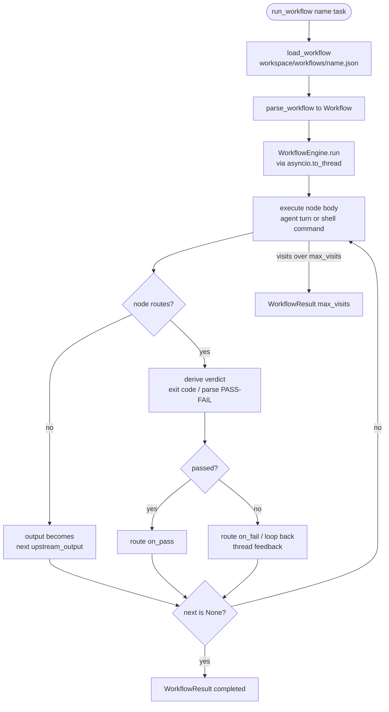

# Workflow engine — User-defined flow graphs

## 1. Purpose

The workflow engine lets a user define a multi-step process as a **flow graph** and
run a task through it. Instead of a single agent turn, a task moves through a graph
of **nodes** the user draws. A node does a piece of the task — a real agent turn with
its own model, tools, and session, or a shell command — and **optionally routes** the
flow (continue, branch, or loop back) on a pass/fail verdict. Routing is opt-in, not a
separate node type. The graph is a plain JSON
document under `<workspace>/workflows/<name>.json`, so it can be authored by a human,
a UI, or an agent; the agent runs one with the `run_workflow` tool.

The engine is **deterministic**: the user's graph drives routing; the LLM does the
work *inside* nodes, it does not decide the path. It runs *above* `AgentRunner` (the
core agent loop is untouched) and reuses the session-lineage primitive, so every
node's work is a persisted, searchable session rather than ephemeral state.

## 2. Mental model

**A workflow is a graph of nodes, not a fixed pipeline.** A `Workflow`
(`durin/workflow/spec.py`) is a set of nodes keyed by id, a `start` node id, and a
per-node visit cap (`max_visits`). There is **one node type** (`WorkNode`): it carries a
model (or the default), a context policy (`own` vs `shared` session), a tool set (`none`
vs `default`), a prompt, optional skills/MCP, and either a single `next` edge or — when it
**routes** — a pair of targets (`on_pass`, `on_fail`). A node whose body is a shell
`command` runs that instead of an agent turn. A `None` target ends the run. The parser
validates that the start and every edge target name a real node, and that `next` and
routing are not both set. (`kind: "decision"` is accepted as a back-compat alias for a
routing node — `criteria` maps to the node's `prompt`.)

**A node runs its body, then optionally routes.** `WorkflowEngine.run`
(`durin/workflow/engine.py`) walks the graph from `start`. For an agent node it calls a
`NodeRunner` — by default `AgentNodeRunner` (`durin/workflow/node_runner.py`), which
runs one `AgentRunner` turn with that node's model and tool registry, then persists
the node's conversation as a session keyed `workflow:<run_id>:<node_id>:<iteration>`
with lineage (`origin_type="workflow_node"`). A node is configured independently and
focused by default. Its **work mode** is an `AgentMode` (`durin/agent/agent_mode.py`) —
`build` (default, full access), `plan`/`explore` (read-only), or a registered custom
mode — that sets the node's posture (a prompt suffix) and filters its tool registry to
what the mode allows, so a read-only node literally cannot write regardless of what the
model attempts. Besides the mode, a node carries its model, context and built-in
`tools`, plus the **skills** to inject into its own prompt (loaded the same way the main
agent loads a skill) and the **MCP servers** whose tools it may use — a scoped subset of
the already-configured servers, reused from the gateway's live connections (no per-node
reconnect; the call is marshalled back to the gateway's event loop, where the MCP
session lives). Skills/MCP default empty, so a node sees only what its job needs. The node's output passes along the edge
as the next node's input. A `shared`-context node reads and extends a running
conversation buffer; an `own`-context node is isolated and receives only the upstream
output. **Output travels two channels.** The **text** of a node's output is the edge — it
becomes the next node's input (above). For **files**, each agent node with file tools is
also given a keyed **output folder** (`<workspace>/.workflow/<run>/<node>/<iteration>/`,
`durin/workflow/artifacts.py`) and is told both where to write its own files and where the
previous step's folder is, so a produced file can be handed onward without the path being
guessed. The folder is keyed by run/node/iteration, so it never collides across loop-back
re-iterations or concurrent/repeated invocations, and it follows the same edge-threading as
the text (a passing judge's empty folder never replaces the producer's). The `.workflow` tree
gitignores itself, is excluded from parallel-fork reconciliation, and is pruned to recent
runs. (Real deliverables a node writes into the workspace proper are the separate,
already-shared filesystem channel — unchanged.) **When a node routes** (it has `on_pass`/`on_fail`), the engine derives a
pass/fail verdict from what the node produced: a **command** node passes iff its shell
command exits 0 (`durin/workflow/condition.py`, run in the workflow's workspace so it
sees files earlier nodes wrote); an **agent** node ends its own reply with a `PASS`/`FAIL`
line the engine parses (`durin/workflow/verdict.py`) — so a routing agent node can
*verify* (read the diff, run the tests) before ruling, not just read text. The engine
routes to `on_pass` or `on_fail`; on a fail the node's feedback is threaded into the
loop-back so the producer re-runs knowing what to fix. Routing agent nodes default to
**explore** (read-only) mode. **Independence is a graph rule, not a node type:** the
parser rejects a routing agent node that is *structurally identical* (same model, mode,
and prompt) to the producer feeding it, so a quality verdict comes from a genuinely
independent reviewer (the anti-Goodhart guard). A node can also be a **sub-workflow**
(`durin/workflow/subworkflow.py`): it runs another named workflow as a nested run
(reusing the same node and branch-pick runners, bounded by a depth cap) and uses its output;
the nested run carries the same root session key, so its node sessions anchor to the
invoking conversation too.
A **parallel** node runs a set of work-node branches concurrently and merges their text
outputs into the next node's input. Its `reconcile` mode decides how branch *writes*
come back together (`durin/workflow/workspace_fork.py`): `read` = read/analysis
branches, no writes applied; `choose` = each branch writes in a private copy of the
workspace and a judge picks one to apply, discarding the rest; `union` = apply every
branch's writes, aborting on a genuine conflict (two branches wrote *different* content
to the same path — identical incidental files reconcile cleanly). A per-node visit count
bounds loop-backs: exceeding `max_visits` ends the run with status `max_visits` instead
of looping forever.

**The engine is decoupled from the LLM and runs loop-safe.** The graph walk depends
only on an injected `NodeRunner` callable, so it is fully unit-testable with a mock.
The real runner drives the async `AgentRunner` synchronously per node, so the
`run_workflow` tool runs the whole (synchronous) engine via `asyncio.to_thread` — the
inner `asyncio.run` then executes in a worker thread with no active event loop, which
is valid even though the tool itself runs inside the agent's async tool loop.

## 3. Diagram

## 4. How it works

End-to-end for a single `run_workflow` call:

1. **Load.** `RunWorkflowTool.execute` (`durin/agent/tools/run_workflow.py`) loads the
   named definition with `load_workflow` (`durin/workflow/loader.py`), which reads
   `<workspace>/workflows/<name>.json` and parses it with `parse_workflow`. A missing
   file returns an error string (it does not raise).
2. **Wire.** It resolves the user's default model preset
   (`DurinConfig.resolve_default_preset`), builds the provider (`make_provider`), and
   wires `AgentRunner` → `AgentNodeRunner` (passing the user's real `cfg.tools`), an
   `AgentJudgeRunner` (used only to **pick** a winner for parallel `choose`), and a
   `SubworkflowRunner` (for sub-workflow nodes) into the `WorkflowEngine`.
3. **Run.** The engine runs under `asyncio.to_thread`. It walks the graph: a node runs
   its body (an agent turn — persisting a lineage'd node session — or a shell command)
   and its output threads to the next node; a **routing** node branches on its command's
   exit code or the `PASS`/`FAIL` verdict in its own agent output (threading the feedback
   into the loop-back on fail); a sub-workflow node runs a nested workflow; a failed gate
   loops back, re-running the target node as the next iteration (a sibling node session),
   capped by `max_visits`.
4. **Return.** The run produces a typed `WorkflowResult` (status + final output +
   per-node trace), which the tool formats into a short summary for the agent. The
   node sessions persist on disk, so the run's work is navigable, searchable, and
   visible to the dream memory passes — the same way subagent and cron per-run sessions
   are (see [cron.md](cron.md), [memory/00_overview.md](memory/00_overview.md)).

## 5. Key types & entry points

| Symbol | File | Role |
|---|---|---|
| `Workflow`, `WorkNode`, `SubworkflowNode`, `ParallelNode`, `parse_workflow` | `durin/workflow/spec.py` | The flow-graph definition and its JSON parser/validator (one node type; routing optional; `kind:"decision"` back-compat alias; structural-equivalence guard). |
| `parse_verdict` | `durin/workflow/verdict.py` | The `PASS`/`FAIL` contract read from a routing agent node's own output (default `FAIL`). |
| `artifact_dir`, `prune_runs` | `durin/workflow/artifacts.py` | The per-node file hand-off folder keyed by run/node/iteration (self-gitignored, pruned to recent runs). |
| `run_command`, `CommandOutcome` | `durin/workflow/condition.py` | The shell-exit-code condition a command node routes on. |
| `AgentJudgeRunner` | `durin/workflow/judge.py` | The branch-pick reviewer: `pick` chooses the best of N outputs for a parallel `choose` reconcile. |
| `fork`, `diff`, `conflicts`, `apply` | `durin/workflow/workspace_fork.py` | Per-branch workspace isolation + reconciliation (choose/union) for writing-in-parallel. |
| `WorkflowVersionStore` | `durin/workflow/version_store.py` | Git versioning of workflow definitions: each run snapshots them; `history` reads the timeline. |
| `SubworkflowRunner` | `durin/workflow/subworkflow.py` | Runs a named workflow as a nested run (depth-capped) for a sub-workflow node. |
| `WorkflowEngine` | `durin/workflow/engine.py` | The graph executor: routing, loop-back with a visit cap, own/shared context, output threading, and concurrent parallel branches. |
| `AgentNodeRunner` | `durin/workflow/node_runner.py` | The default node runner: one real `AgentRunner` turn per agent node (adds a verdict instruction when the node routes), persisted as a lineage'd node session. |
| `load_workflow` | `durin/workflow/loader.py` | Load and parse a workflow by name from the workspace. |
| `WorkflowResult`, `NodeRun` | `durin/workflow/result.py` | The typed run outcome and per-node trace. |
| `RunWorkflowTool` | `durin/agent/tools/run_workflow.py` | The `run_workflow` LLM tool (core scope) that loads, runs, summarizes a workflow, and records its run. |
| `write_run`, `read_runs_since` | `durin/workflow/run_log.py` | Per-run diagnostic records (beside `workflows/`), the self-improvement signal source. |
| `compute_diagnostics` | `durin/workflow/diagnostics.py` | Reduces run records to recurring per-node trouble (loop-backs, gate fails) → improvement candidates. |
| `run_workflow_improve_pass` | `durin/workflow/workflow_improve_dream.py` | The dream pass: observes manual-mode workflows, proposes one scoped edit, records a recommendation. |
| `log_recommendation`, `open_recommendations` | `durin/workflow/workflow_recommendations.py` | The per-workflow recommendation queue (manual mode). |

## 6. Configuration & surfaces

- **Definitions** live as JSON under `<workspace>/workflows/<name>.json`. That
  directory is a small local git repo (`durin/workflow/version_store.py`, via the
  shared `GitRepo`); every run snapshots the current definitions, so there is a
  navigable version history of how each workflow changed and which version a run used.
- **Surface:** the `run_workflow(name, task)` LLM tool — auto-discovered into the
  agent's tool registry at core scope (see [tools.md](tools.md)). A node with
  `tools: "default"` receives the user's configured tool set; `tools: "none"` (the
  default) runs the node without tools. A node may also name `skills` (injected into
  its prompt) and `mcps` (a subset of the configured MCP servers, reused live).
- **Management API:** `WorkflowsService` (`durin/service/workflows.py`) exposes, over HTTP
  at `/api/v1/workflows[/{name}]` and in the OpenAPI contract: list / load / save / delete
  (save validates via `parse_workflow` and writes atomically under the version lock — the
  same lock target the version store snapshots under, beside the dir, so a write and a
  snapshot never interleave); **run** (`…/{name}/run` — executes the workflow on a task and
  returns the per-node trace); and the **recommendations** queue (`…/recommendations`,
  `…/recommendations/{id}/apply`). This is the surface the webui visual editor uses.
- **Lineage:** node sessions reuse the lineage metadata on the open session document
  (`durin/session/lineage.py`), so no schema migration is involved.
- **Self-improvement** (per-workflow `improvement_mode`: `off` default / `manual` /
  `auto`). Each run writes a diagnostic record (`run_log.py`, beside `workflows/`). A
  dream pass (`run_workflow_improve_pass`, wired into the `memory_dream` cron) reduces
  those to recurring trouble (a node that loops, a gate that keeps failing —
  `diagnostics.py`), shows a model the definition + that diagnostic + the change history
  (so it never re-proposes a reverted edit), and proposes one scoped edit (a node's
  `prompt` — which doubles as a routing node's criteria; structural edits rejected). In **manual** mode the
  proposal is recorded as a recommendation (`workflow_recommendations.py`); the user
  reviews and applies it — from the webui Workflows pane (a recommendations banner with an
  apply button) or the `durin workflow` CLI (`recommendations` lists open ones,
  `apply <name> <id>`) — which writes the proposed text into the node, versions the edit
  with its reason, and marks it applied; the anti-Goodhart anchor is the human.
  **auto** mode (apply directly, gated by an external validation signal so it can't win
  by loosening gates) is the next slice; the apply step + seam are in place.
- **Current scope.** This subsystem is built incrementally. Today: sequential execution
  with **concurrent parallel** branches — read-only, or **writing** with `choose` /
  `union` reconciliation (private copy per branch + content-aware conflict detection);
  per-node **work mode** (build/plan/explore) / model / context / tools / **skills** /
  **MCP servers**; **optional routing** — any node can branch on a shell command's exit
  code or the `PASS`/`FAIL` verdict in its own agent output (feedback-threaded loop-back),
  with an anti-Goodhart guard that a routing node not be structurally identical to its
  producer; **sub-workflow** composition (depth-capped); runs **anchored to the invoking
  session**; **git-versioned definitions** (each run snapshots them); **dream-driven
  self-improvement in manual mode** (recommendations from recurring run diagnostics); and
  a **webui Workflows pane** (React Flow, at the same nav level as Memoria/Skills) that
  **creates, renders, edits, saves, and runs** a workflow — new workflow from the list
  header (a minimal one-node graph to edit from), `work`/`decision`/`gate` palette presets
  (all one node type), per-node config (mode / model / context / tools / prompt) with an
  optional **routing** toggle (pass/fail targets), add/delete nodes and wire edges by
  dragging, set the start node, run on a task with the per-node trace shown inline, and
  apply self-improvement recommendations. Not yet built — see [roadmap.md](../roadmap.md) for direction —
  auto-mode self-improvement (apply + validation anchor), auto-merge of conflicting
  parallel writes, and per-node custom persona.
- **Security.** Definitions are local files the user authored, so running their
  commands and tools is equivalent to the user running them directly; importing remote
  or third-party definitions is not supported in this scope (see [security.md](security.md)).
