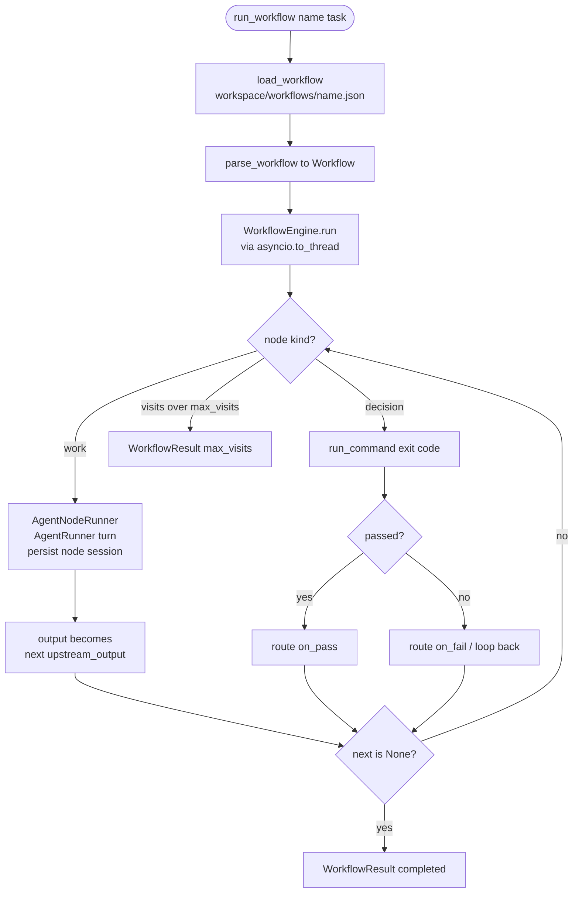

# Workflow engine — User-defined flow graphs

## 1. Purpose

The workflow engine lets a user define a multi-step process as a **flow graph** and
run a task through it. Instead of a single agent turn, a task moves through a graph
of **nodes** the user draws: *work nodes* do a piece of the task (a real agent turn,
with their own model, tools, and session) and *decision nodes* route the flow —
continue, branch, or loop back — based on a condition. The graph is a plain JSON
document under `<workspace>/workflows/<name>.json`, so it can be authored by a human,
a UI, or an agent; the agent runs one with the `run_workflow` tool.

The engine is **deterministic**: the user's graph drives routing; the LLM does the
work *inside* nodes, it does not decide the path. It runs *above* `AgentRunner` (the
core agent loop is untouched) and reuses the session-lineage primitive, so every
node's work is a persisted, searchable session rather than ephemeral state.

## 2. Mental model

**A workflow is a graph of nodes, not a fixed pipeline.** A `Workflow`
(`durin/workflow/spec.py`) is a set of nodes keyed by id, a `start` node id, and a
per-node visit cap (`max_visits`). A `WorkNode` carries a model (or the default), a
context policy (`own` vs `shared` session), a tool set (`none` vs `default`), a
prompt, and the id of its next node. A `DecisionNode` carries a condition and two
targets (`on_pass`, `on_fail`); a `None` target ends the run. The parser validates
that the start and every edge target name a real node.

**Work nodes run real agent turns; decision nodes route.** `WorkflowEngine.run`
(`durin/workflow/engine.py`) walks the graph from `start`. For a work node it calls a
`NodeRunner` — by default `AgentNodeRunner` (`durin/workflow/node_runner.py`), which
runs one `AgentRunner` turn with that node's model and tool registry, then persists
the node's conversation as a session keyed `workflow:<run_id>:<node_id>:<iteration>`
with lineage (`origin_type="workflow_node"`). The node's output passes along the edge
as the next node's input. A `shared`-context node reads and extends a running
conversation buffer; an `own`-context node is isolated and receives only the upstream
output. For a decision node the engine evaluates the condition — either a shell
command (`durin/workflow/condition.py`, pass iff it exits 0) or an agent **judgment**
(`durin/workflow/judge.py`, a reviewer agent on a fresh context evaluates the upstream
output against the node's `criteria`) — and routes to `on_pass` or `on_fail`; on a
judgment fail the reviewer's feedback is threaded into the loop-back so the producer
re-runs knowing what to fix. A node can also be a **sub-workflow**
(`durin/workflow/subworkflow.py`): it runs another named workflow as a nested run
(reusing the same node and judge runners, bounded by a depth cap) and uses its output.
A per-node visit count bounds loop-backs: exceeding `max_visits` ends the run with
status `max_visits` instead of looping forever.

**The engine is decoupled from the LLM and runs loop-safe.** The graph walk depends
only on an injected `NodeRunner` callable, so it is fully unit-testable with a mock.
The real runner drives the async `AgentRunner` synchronously per node, so the
`run_workflow` tool runs the whole (synchronous) engine via `asyncio.to_thread` — the
inner `asyncio.run` then executes in a worker thread with no active event loop, which
is valid even though the tool itself runs inside the agent's async tool loop.

## 3. Diagram

## 4. How it works

End-to-end for a single `run_workflow` call:

1. **Load.** `RunWorkflowTool.execute` (`durin/agent/tools/run_workflow.py`) loads the
   named definition with `load_workflow` (`durin/workflow/loader.py`), which reads
   `<workspace>/workflows/<name>.json` and parses it with `parse_workflow`. A missing
   file returns an error string (it does not raise).
2. **Wire.** It resolves the user's default model preset
   (`DurinConfig.resolve_default_preset`), builds the provider (`make_provider`), and
   wires `AgentRunner` → `AgentNodeRunner` (passing the user's real `cfg.tools`), an
   `AgentJudgeRunner` (for judgment decision nodes), and a `SubworkflowRunner` (for
   sub-workflow nodes) into the `WorkflowEngine`.
3. **Run.** The engine runs under `asyncio.to_thread`. It walks the graph: a work node
   runs an agent turn and persists a lineage'd node session; its output threads to the
   next node; a decision node routes on its command's exit code or a reviewer's
   judgment (threading the reviewer feedback into the loop-back on fail); a sub-workflow
   node runs a nested workflow; a failed gate loops back, re-running the target node as
   the next iteration (a sibling node session), capped by `max_visits`.
4. **Return.** The run produces a typed `WorkflowResult` (status + final output +
   per-node trace), which the tool formats into a short summary for the agent. The
   node sessions persist on disk, so the run's work is navigable, searchable, and
   visible to the dream memory passes — the same way subagent and cron per-run sessions
   are (see [cron.md](cron.md), [memory/00_overview.md](memory/00_overview.md)).

## 5. Key types & entry points

| Symbol | File | Role |
|---|---|---|
| `Workflow`, `WorkNode`, `DecisionNode`, `SubworkflowNode`, `parse_workflow` | `durin/workflow/spec.py` | The flow-graph definition and its JSON parser/validator. |
| `run_command`, `CommandOutcome` | `durin/workflow/condition.py` | The shell-exit-code condition a decision node routes on. |
| `JudgeVerdict`, `AgentJudgeRunner` | `durin/workflow/judge.py` | The reviewer agent that returns a pass/fail verdict + feedback for a judgment decision node. |
| `SubworkflowRunner` | `durin/workflow/subworkflow.py` | Runs a named workflow as a nested run (depth-capped) for a sub-workflow node. |
| `WorkflowEngine` | `durin/workflow/engine.py` | The sequential graph executor: routing, loop-back with a visit cap, own/shared context, output threading. |
| `AgentNodeRunner` | `durin/workflow/node_runner.py` | The default node runner: one real `AgentRunner` turn per work node, persisted as a lineage'd node session. |
| `load_workflow` | `durin/workflow/loader.py` | Load and parse a workflow by name from the workspace. |
| `WorkflowResult`, `NodeRun` | `durin/workflow/result.py` | The typed run outcome and per-node trace. |
| `RunWorkflowTool` | `durin/agent/tools/run_workflow.py` | The `run_workflow` LLM tool (core scope) that loads, runs, and summarizes a workflow. |

## 6. Configuration & surfaces

- **Definitions** live as JSON under `<workspace>/workflows/<name>.json`.
- **Surface:** the `run_workflow(name, task)` LLM tool — auto-discovered into the
  agent's tool registry at core scope (see [tools.md](tools.md)). A work node with
  `tools: "default"` receives the user's configured tool set; `tools: "none"` (the
  default) runs the node without tools.
- **Lineage:** node sessions reuse the lineage metadata on the open session document
  (`durin/session/lineage.py`), so no schema migration is involved.
- **Current scope.** This subsystem is built incrementally. Today: sequential
  execution; per-node model / context / tools; decision conditions by **shell command
  or agent judgment** (with feedback-threaded loop-back); and **sub-workflow**
  composition (depth-capped). Not yet built — see [roadmap.md](../roadmap.md) for
  direction — parallel fan-out/fan-in, per-node skills / MCPs / persona, anchoring a
  run to the invoking session, a visual editor, internal-git versioning of definitions,
  and dream-driven self-improvement of workflows.
- **Security.** Definitions are local files the user authored, so running their
  commands and tools is equivalent to the user running them directly; importing remote
  or third-party definitions is not supported in this scope (see [security.md](security.md)).
