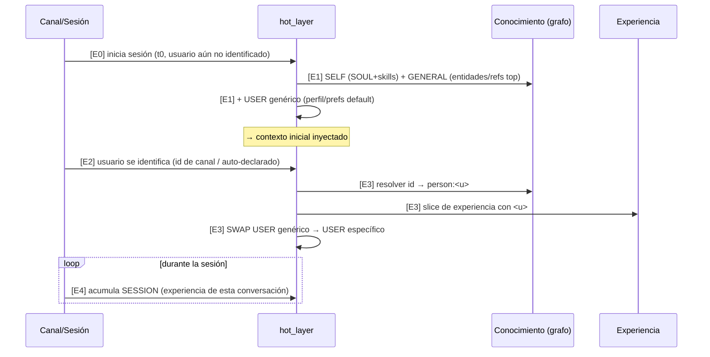

# Contexto de memoria pre-cargado en sesión

> **Estado**: working — diagrama vivo. Lo refinamos **etapa por etapa**.
> Parte de [memory_model_redesign.md](memory_model_redesign.md).

La pre-carga es **dinámica y por capas**, no un archivo (USER.md/MEMORY.md
se disuelven). La ensambla el `hot_layer` al construir el prompt.

## Scopes (qué se comparte)

```
SCOPE            QUÉ                                           COMPARTICIÓN
[ SELF ]         SOUL (comportamiento) + índice de skills      compartido, siempre
[ GENERAL ]      conocimiento general: entidades top/known,    compartido, siempre
                 referencias clave, hechos del mundo
[ SYSTEM ]       entidad system:local (entorno/instalación:    compartido, siempre
                 paths, tools, capacidades, config)
[ PRINCIPAL ]    a quién sirvo, vista COMPUESTA (no guardada): por-principal (cadena
  (ex-"USER")    person: resuelto + sus stance/practice         id → owner → anonymous)
                 + ancla user_authored. Resolución:
                 channel-id → owner (default) → anonymous
[ SESSION ]      memoria de la sesión actual (qué pasó acá)    por-sesión (compartida
                                                                entre participantes)
```

**Nota (§2.12)**: "USER" se generaliza a **PRINCIPAL** = la entidad a la que el
agente sirve (humano, otro agente, o el sistema), resuelta por la cadena
`channel-id → owner → person:anonymous`. La vista se **ensambla** (person +
stance/practice + ancla user_authored), no se guarda como `user.md`. Y se suma
el scope **SYSTEM** (entorno), que faltaba.

**Modelo de compartición** (clave): el **grafo de conocimiento es mayormente
compartido** (el mundo es el mundo; mxHERO es mxHERO para todos) — excepto
las entidades que SON un usuario. La **experiencia es por-usuario** (mi
historia con <u>) **+ general** (actividad/eventos compartidos).

## Diagrama (flujo temporal)



## Etapas (a refinar al fino)

### E0 — Inicio de sesión (t0)
- **Qué**: arranca la sesión; el usuario aún no está identificado.
- **Pendiente**: —

### E1 — Carga base (genérica)
- **Quién/qué**: `hot_layer` ensambla **SELF** (SOUL + índice de skills) +
  **GENERAL** (entidades top/known, referencias clave) + **USER genérico**
  (perfil/prefs default).
- **Pendiente**: **qué entra en GENERAL vs qué se deja a search bajo demanda**
  (presupuesto de tokens); cómo es el "usuario genérico" por defecto.

### E2 — Identificación del usuario (t1)
- **Quién/qué**: el canal aporta un user-id, o el usuario se auto-declara.
- **Pendiente**: el mapeo **channel-user-id → `person:<u>`** es en parte el
  problema no resuelto de identidad cross-channel (R4). Trivial para webui
  (dueño único); manual/LLM en multi-channel.

### E3 — SWAP a usuario específico
- **Quién/qué**: resuelve `person:<u>` (entidad) + su **slice de experiencia**
  (mi historia con <u>); reemplaza el USER genérico por el específico.
- **Pendiente**: cómo se hace el SWAP a mitad de sesión **sin perder
  coherencia** (lo ya dicho con el genérico); qué es exactamente "slice de
  experiencia de <u>".

### E4 — Acumulación de SESSION
- **Quién/qué**: durante la conversación se acumula la memoria de sesión
  (experiencia del aquí-y-ahora), compartida entre participantes.
- **Pendiente**: ¿SESSION compartida implica **multi-usuario en una misma
  sesión** (grupo)? ¿cómo se atribuye cada turno a su autor?
