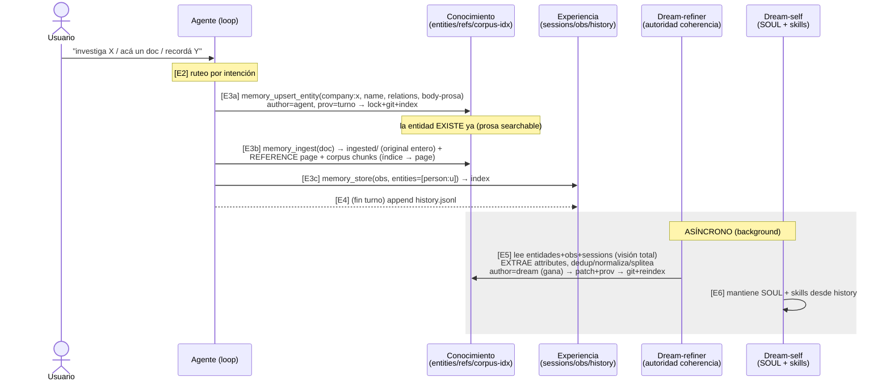

# Secuencia: Ingesta de memoria (escritura)

> **Estado**: working — diagrama vivo. Lo refinamos **etapa por etapa**:
> cada etapa describe qué hace, quién, qué escribe, con qué provenance.
> Parte de [memory_model_redesign.md](memory_model_redesign.md).

Actores: **Usuario** · **Agente** (loop) · tools (`memory_store` /
`memory_upsert_entity` / `memory_ingest`) · **Conocimiento** (entities +
references + corpus-index) · **Experiencia** (sessions + obs + history) ·
**Dream-refiner** (autoridad de coherencia, ex-Track B) · **Dream-self**
(SOUL + skills, ex-Track A).

## Diagrama

## Etapas (a refinar al fino)

### E1 — Usuario aporta
- **Qué**: el usuario manda un hecho, un documento, o una instrucción de recordar.
- **Pendiente**: —

### E2 — Agente rutea por intención
- **Qué**: el agente clasifica el aporte en {hecho-de-entidad, observación, documento}.
- **Pendiente**: ¿cómo se le instruye el ruteo? (prompt / tool descriptions). ¿Qué pasa con aportes mixtos?

### E3a — Upsert entidad (agente-light)
- **Quién/qué**: `memory_upsert_entity(ref, name, aliases, relations, body)`. Merge, no replace. `author=agent`, `prov=turno`. Pipeline `dream_apply` (lock+git+index). Entidad existe ya.
- **Pendiente**: forma exacta del tool; qué pasa si `ref` no existe (crea) vs existe (merge); body append vs replace.

### E3b — Ingesta de documento
- **Quién/qué**: `memory_ingest(doc)` → `ingested/<id>/source` (original entero) + **REFERENCE page** (coherente, linkea entidades) + chunks `corpus` (índice → apunta a la page). Marcador REFERENCE.
- **Pendiente**: structure-aware vs blind-chunk; cómo se linkea la page a entidades; el agente ingiere mal hoy (blob KB).

### E3c — Observación a experiencia
- **Quién/qué**: `memory_store(obs, entities=[...])` → capa experiencia → index. La observación **referencia** entidades, no las crea.
- **Pendiente**: definir la capa experiencia (doc aparte / §3.2); cómo no se pisa con E3a.

### E4 — Cierre de turno
- **Qué**: el loop appendea el turno a `history.jsonl` (log de experiencia).
- **Pendiente**: ¿`history.jsonl` sigue, o se reemplaza por sessions/summaries?

### E5 — Dream-refiner (async)
- **Quién/qué**: con visión total, **extrae attributes** (dueño del esquema), dedup/normaliza/splitea/mergea, resuelve contradicciones → temporal validity. `author=dream` (gana). patch+prov por el pipeline.
- **Pendiente**: **quién lo dispara** (reactivo a cada escritura / debounce / cron); presupuesto de visión (no todo en un prompt → recupera por decisión).

### E6 — Dream-self (async)
- **Quién/qué**: mantiene **SOUL** (comportamiento) + crea/edita **skills** desde history. (USER.md/MEMORY.md disueltos → ver [memory_context_preload.md](memory_context_preload.md).)
- **Pendiente**: ¿qué queda del cron `dream` legacy una vez disuelto USER/MEMORY? ¿Se fusiona con E5 en un solo cron?
