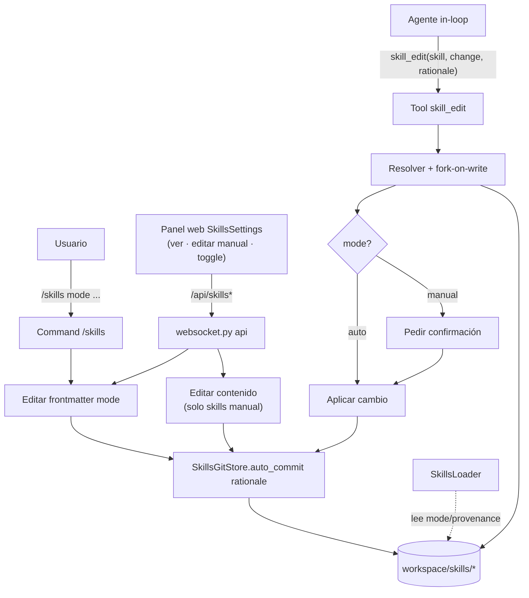
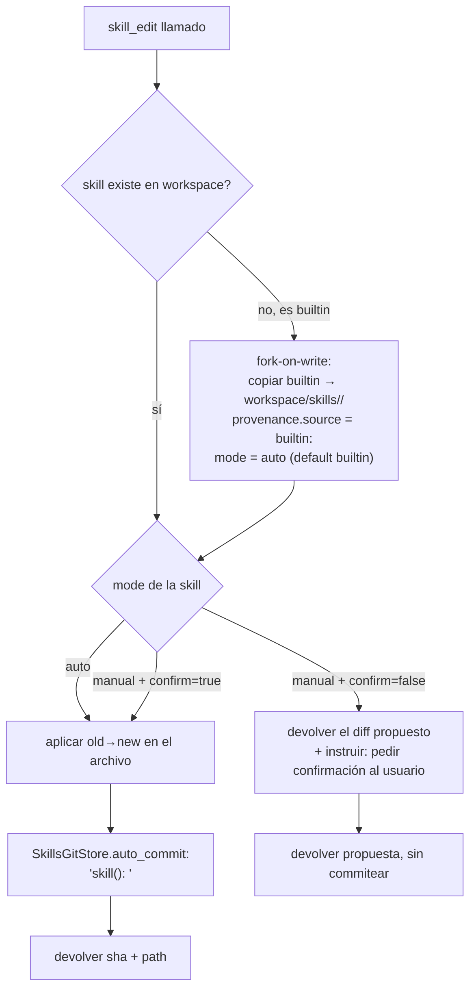
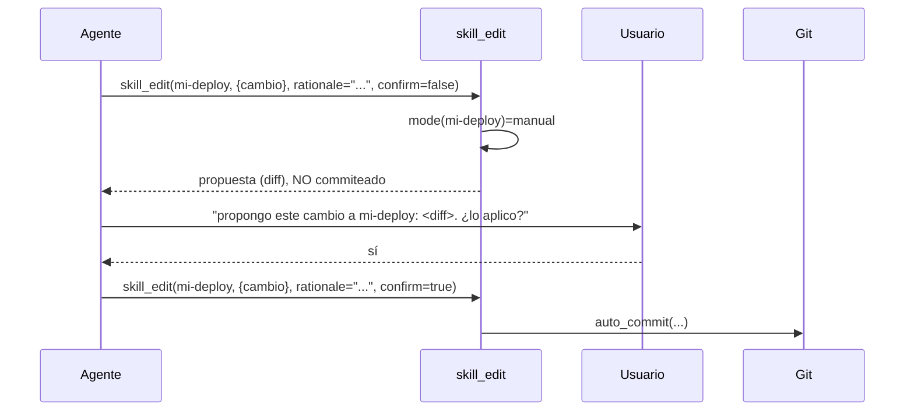

# Spec — Skills Evolution MVP (Etapa 1)

> **Estado:** ✅ **SHIPPED** (PR #19, merge `e595fd6`, 2026-06-02). Es la
> **Etapa 1** del sistema de skills evolutivas. No reemplaza el plan-fuente; lo
> aterriza a un MVP implementable. Decisiones tomadas vía brainstorming el
> 2026-06-01. La **Etapa 2** la diseña
> [`2026-06-02-skills-evolution-e2-design.md`](2026-06-02-skills-evolution-e2-design.md).
>
> **Fuentes:** [`docs/archive/skills_evolutivas.md`](../../archive/skills_evolutivas.md)
> (la visión §1–§9) · [`docs/research/hermes_skills_codebase.md`](../../research/hermes_skills_codebase.md)
> (referencia de código Hermes, verificada línea-por-línea).

---

## §0 — Una frase

En el MVP, **una skill deja de ser un archivo suelto y pasa a ser una entidad
versionada y con modo**: el agente la evoluciona in-loop vía un tool que
commitea cada cambio con su *porqué* (reversible), y un flag `auto|manual`
por-skill decide si el agente puede editarla solo o necesita tu confirmación.

Nada más. Sin import, sin remoto, sin cristalizar-desde-uso, sin gate
automático. Eso es lo que construyen las etapas siguientes.

---

## §1 — Dónde encaja (roadmap, simple → complejo)

El MVP es el **substrato** que las demás etapas reusan. Se eligió primero por
ser el de menor riesgo y mayor reuso.

```
E1 ─ MVP ─────────  Skills versionadas + modo auto/manual + tool de edición
       │            (puro local; sin remoto; sin piso de seguridad nuevo)
       ▼
E2 ─ Cristalizar    Dream escribe/parchea skills desde tu uso real
       │            (resolver trigger §8.A del plan-fuente)
       ▼
E3 ─ Import+Adapt   Three-layer original/adapted + provenance de marketplace
       │            + pipeline 2-etapas + piso de seguridad §8.C
       ▼
E4 ─ Acquire+Search Búsqueda federada remota (acquire-on-gap) +
       │            indexar skills en el motor vector+FTS+RRF (type propio)
       ▼
E5 ─ Meta-skill     El sistema se auto-hospeda + Capa B opcional (GEPA/SkillOpt)
```

Cada flecha hacia abajo **reusa** lo de arriba: el git-store y el modelo de
provenance del MVP son la base de E2–E5; el fork-on-write del MVP es el germen
del `original/adapted` de E3; el `type` de retrieval se **diseña** acá y se
**construye** en E4.

---

## §2 — Alcance

### Entra (MVP)

1. **Versionado** de `workspace/skills/` en un git-store **separado** del de
   memoria.
2. **Tool `skill_edit`** — única vía sancionada para evolucionar una skill:
   patchea + commitea con `rationale` obligatorio. Incluye **fork-on-write** de
   builtins.
3. **Modelo `provenance` + `mode`** en el frontmatter (`metadata.durin.*`).
4. **Modos `auto|manual`** por-skill, con defaults por origen.
5. **Config + WebUI:** slash-command `/skills` (listar + setear modo) **y** panel
   web tipo el de memoria: **ver** todas las skills, su estado **auto/manual**,
   **editar las `manual`** (con commit), y togglear el modo.
6. **`SkillsLoader`**: cambios mínimos para leer `mode`/`provenance` y exponer
   el campo `source` de fork.
7. **Formato = estándar abierto** (agentskills.io-compatible) — §3.5.

### No entra (diferido, con su etapa)

| Diferido | Etapa | Por qué no ahora |
|---|---|---|
| Gate blando automático (replay/canary/feedback decide aceptar/revertir) | post-E1 | Necesita telemetría de uso de skills inexistente; **vos sos el gate** en el MVP |
| Cristalizar desde uso (Dream autorea skills) | E2 | Trigger §8.A es decisión abierta |
| Import / marketplace / three-layer `original/adapted` / piso de seguridad | E3 | Necesita estándar de interop §8.B (load-bearing) |
| Acquire-on-gap remoto + indexar skills en el search | E4 | Paga al crecer el catálogo; con catálogo chico, progressive-disclosure es más barato (YAGNI) |
| Watcher de ediciones manuales del filesystem | — | Se eligió tool-in-loop; el modo manual se maneja por confirmación, no por watcher |

---

## §3 — El concepto, en su forma más simple

Una skill hoy = un directorio con `SKILL.md` (frontmatter YAML + cuerpo
markdown) + opcional `scripts/`/`references/`. El MVP **no cambia eso**; solo
agrega dos campos al frontmatter y pone el directorio bajo git.

```
workspace/skills/<name>/
├── SKILL.md          ← frontmatter gana 2 campos nuevos (abajo)
├── scripts/          ← editable por el tool (código = capacidad de mayor riesgo)
└── references/
```

Frontmatter — los campos nuevos viven bajo `metadata.durin` (convención que
[`skills.py`](../../../durin/agent/skills.py) ya parsea para `always`):

```yaml
---
name: my-skill
description: ...
metadata:
  durin:
    mode: auto            # auto | manual  (default por origen, ver §6)
    provenance:
      source: "builtin:my-skill"   # builtin:<name> | user-created | (futuro: marketplace:.../experience:DATE)
      created_at: "2026-06-01"
---
```

- **`mode`** gatea al tool (§5).
- **`provenance.source`** = el *origen* (linaje). Es distinto del campo `source`
  que `SkillsLoader` ya emite (`"workspace"|"builtin"`, que es *ubicación de
  filesystem*). No chocan: uno está anidado en `provenance`, el otro es la
  posición en disco.
- El **`git log` del store de skills es el log de evolución** — el *porqué* de
  cada cambio vive en el commit message, no en el frontmatter.

---

## §3.5 — Formato e interoperabilidad (estándar abierto)

**Sí — adoptamos el estándar abierto (`agentskills.io`-compatible) como baseline
de formato en disco.** Es casi gratis y blinda E3/E4.

Por qué casi gratis: el formato de durin (`SKILL.md` con frontmatter YAML
`name`+`description` + cuerpo + `scripts/`) **ya es ~compatible**. La prueba
fuerte: la migración OpenClaw→Hermes fue un `copytree` byte-a-byte *porque "los
formatos ya coinciden"* (ver `hermes_skills_codebase.md` §4). El estándar define
`name`, `description`, `version`, `license`, `compatibility`, `metadata` — y un
campo `metadata` **abierto** para extensiones de vendor.

Cómo encaja lo nuestro:

- **Campos core** (`name`, `description`, y opcionalmente `version`/`license`) =
  estándar, portables.
- **`mode` y `provenance`** van bajo **`metadata.durin.*`** — que **es el punto
  de extensión del estándar**, no una desviación. Son política de runtime de
  durin, no parte de la definición portable de la skill (una skill exportada a
  otro agente no debería arrastrar nuestro flag auto/manual como campo de primera
  clase). Es exactamente cómo Hermes namespacea bajo `metadata.hermes.*`.

Qué **no** entra en el MVP (es la *maquinaria* del estándar, no el formato):
el Hub/marketplace, el discovery `.well-known/skills/index.json`, el `lock.json`
de provenance de import, y el flujo de install → todo eso es **E3/E4**.

> **La decisión "con dientes" de §8.B** (a *qué* marketplace federar la búsqueda:
> agentskills.io vs Claude-Code-native) es genuinamente una decisión de **E4**.
> A nivel de archivo los dos comparten la misma forma de `SKILL.md`, así que el
> MVP **no queda atado** a ninguno — adoptar el baseline abierto mantiene ambas
> puertas abiertas.

---

## §4 — Arquitectura (componentes)



Cinco unidades, cada una con un propósito y una interfaz claras:

| Unidad | Qué hace | Interfaz | Depende de |
|---|---|---|---|
| **SkillsGitStore** | Versiona `workspace/skills/` (commit + revert + log) | `auto_commit(msg) → sha` · `revert(sha)` · `log()` | dulwich; variante subtree de [`GitStore`](../../../durin/utils/gitstore.py) |
| **`skill_edit` tool** | Aplica un cambio a una skill + commitea con rationale + fork-on-write + gate de modo | tool schema (params abajo) | SkillsGitStore, SkillsLoader |
| **SkillsLoader** (existe) | Carga skills, frontmatter, shadowing, `mode`/`provenance` | `list_skills()` · `get_skill_metadata()` · nuevo `set_mode()` | filesystem |
| **`/skills` command** | Listar skills (source·mode·último commit) + setear modo | `/skills list` · `/skills mode <name> <auto\|manual>` | SkillsLoader, SkillsGitStore |
| **Web (api + panel)** | Ver skills + estado auto/manual; editar las `manual`; togglear modo — §7.5 | `GET /api/skills` · `GET /api/skills/{name}` · `PUT /api/skills/{name}` (manual) · `POST /api/skills/{name}/mode` | SkillsLoader, SkillsGitStore |

---

## §5 — `skill_edit` tool (el corazón del MVP)

### Schema

```
skill_edit(
    skill: str,            # nombre de la skill objetivo
    change: {              # un cambio acotado (no reescritura ciega)
        file: str,         # "SKILL.md" o "scripts/foo.py" (relativo al dir de la skill)
        old: str,          # texto exacto a reemplazar (vacío = crear/append)
        new: str,          # reemplazo
    },
    rationale: str,        # OBLIGATORIO — el "por qué", va al commit message
    confirm: bool = false, # requerido true para skills mode=manual
)
```

> **Por qué `old/new` acotado y no "escribí el archivo entero":** es la
> disciplina de SkillOpt (edición acotada `replace`, no sobreescritura) y hace
> el diff legible y reversible. Espeja el `skill_manage(action=patch)` de Hermes.

### Flujo



**Comportamientos fijados:**

- **Auto-commit sin prompt en `auto`.** Editar un doc de skill local **no** está
  en el piso de seguridad §8.C (eso es *instalar/ejecutar* código o traer de
  fuente fuera de allowlist). Reversible ⇒ barato. Es el patrón de Hermes (el
  fork de fondo parchea sin preguntar).
- **El tool puede editar `scripts/` (código).** La ejecución la sigue gobernando
  el gate de `terminal()` que durin ya tiene — **no** un gate nuevo de skills.
  Es el hallazgo de Hermes §5: gatear el *write* es fricción sin seguridad real
  cuando el agente ya puede ejecutar el mismo código por terminal.
- **`manual` ⇒ confirmación.** El agente puede *proponer* (devuelve el diff),
  pero solo commitea con `confirm=true`, que implica que vos lo aprobaste.
- **Evolución free-form.** El agente juzga qué es "mejor enfoque". El *reward*
  del plan (tools-nativas primero + automatizar lo repetitivo) va como **guía en
  la descripción del tool**, no como lint forzado (eso es etapa posterior).

---

## §6 — Modos y defaults

```
              ┌─────────── mode ───────────┐
              │  auto                manual │
  ────────────┼────────────────────────────┤
  agente edita│  sí, auto-commit     no (solo propone + confirm)
  reversible  │  git revert          git revert
  default si… │  builtin (E1)        user-created (E1)
              │  agente-crea (E2)    usuario-importa (E3)
              │  agente-instala (E4) —
```

- El **mecanismo** (flag + gate + config) se construye entero en el MVP.
- Los **defaults por origen** los aplica cada etapa al sumar su fuente. En E1
  solo existen dos orígenes: **builtin → `auto`** (toolkit propio del agente;
  forkeable), **user-created → `manual`** (lo que vos escribiste, el agente no
  lo toca sin tu OK).
- Cualquier skill se puede flipar de modo con `/skills mode` o el toggle web.

---

## §7 — Flujo end-to-end (los dos caminos)

### Camino A — evolución autónoma (skill `auto`)

```mermaid
sequenceDiagram
    participant Ag as Agente (in-loop)
    participant T as skill_edit
    participant FS as workspace/skills
    participant Git as SkillsGitStore
    Ag->>T: skill_edit(git-helper, {fix paso 3}, rationale="el flag --porcelain evita parseo frágil")
    T->>T: mode(git-helper)=auto
    T->>FS: aplicar old→new en SKILL.md
    T->>Git: auto_commit("skill(git-helper): el flag --porcelain evita parseo frágil")
    Git-->>T: sha 1a2b3c4d
    T-->>Ag: ok, sha=1a2b3c4d
    Note over Ag,Git: vos revisás después con /skills o git log; revert si no te gusta
```

### Camino B — edición de skill `manual`



---

## §7.5 — Panel web (WebUI)

Un panel **`SkillsSettings`** en el dashboard, registrado en `SettingsView.tsx`
junto a `MemorySettings`/`CronSettings`, con las mismas primitivas UI. "Similar
al de memoria" = mismo lugar y estilo en el área de settings; el contenido es un
**browser de skills**.

```
┌─ Skills ───────────────────────────────────────────────┐
│  git-helper        builtin     [AUTO]   1a2b3c4 · hoy   │  ← ver / historial
│  python-testing    imported    [MANUAL] 9f8e7d6 · ayer  │  ← ver / EDITAR
│  mi-deploy         user        [MANUAL] —               │  ← ver / EDITAR
│                                                          │
│  [skill seleccionada] ───────────────────────────────   │
│   provenance: user-created · 2026-05-30                  │
│   modo:  ( ) auto   (•) manual        [aplicar]          │
│   ┌─ SKILL.md (editable porque es manual) ───────────┐   │
│   │ ...                                              │   │
│   └──────────────────────────────────────────────────┘   │
│                            [guardar]  ← commitea con git  │
└──────────────────────────────────────────────────────────┘
```

Reglas del panel:

- **Lista:** todas las skills con nombre, source/provenance, **badge de modo**
  (`AUTO`/`MANUAL`) y último commit (de `SkillsGitStore.log()`).
- **`manual` ⇒ editable:** textarea sobre el `SKILL.md`; *Guardar* hace `PUT
  /api/skills/{name}` que escribe el archivo y **commitea** (rationale por
  defecto `"edit via web"`). Es la superficie de edición del modo manual — sin
  watcher de filesystem.
- **`auto` ⇒ solo lectura** en el panel: la maneja el agente vía `skill_edit`.
  Para tomar control, el usuario la **flipa a `manual`** y entonces se vuelve
  editable. (Editar una `auto` directo en web confundiría la propiedad
  agente-vs-usuario; el toggle es la vía explícita.)
- **Toggle de modo:** `POST /api/skills/{name}/mode` reescribe
  `metadata.durin.mode` y commitea.
- Todo cambio desde web pasa por el **mismo `SkillsGitStore`** ⇒ versionado y
  reversible igual que las ediciones del agente.

---

## §8 — Storage: por qué un store separado

Decisión: **git-store de skills separado del de memoria** (no contaminar la
historia de `SOUL/USER/MEMORY`; un revert agresivo de skills no puede tocar
memoria; las skills *son* otra clasificación).

### Adaptación necesaria de `GitStore` (nota de implementación honesta)

El [`GitStore`](../../../durin/utils/gitstore.py) actual versiona una **lista
fija de archivos enumerados** (`tracked_files`), con un `.gitignore` que hace
`/*` + whitelist, y `auto_commit`/`revert` **iteran esa lista**. Las skills son
un **subárbol con archivos dinámicos** (se crean/borran archivos). Por eso el
MVP necesita una **variante subtree** del store, rooteada en
`workspace/skills/`:

- `init`: repo propio en `workspace/skills/.git`, `.gitignore` permisivo (solo
  ignora ruido: `__pycache__/`, `.archive/`, etc.).
- `auto_commit`: `add` del árbol completo, no de una lista fija.
- `revert`: restaurar el **árbol del padre completo** (borrar archivos que el
  padre no tiene + escribir los que sí) — el `revert` actual, que reescribe
  blobs de una lista fija, **no** sirve para un set dinámico.

Dos opciones de implementación (decidir en el plan, no acá):
**(a)** subclase `SkillsGitStore(GitStore)` que overridea `_build_gitignore`,
`auto_commit`, `revert` para modo-subtree; **(b)** parametrizar `GitStore` con
un flag `track_subtree: bool`. (a) aísla el riesgo; (b) evita duplicación.

### Retrieval — fuera del MVP, pero diseñado

El catálogo no crece en E1 (sin import/cristalizar), así que **se mantiene la
progressive-disclosure** que durin ya tiene (catálogo en tier stable + cuerpos
on-demand). Cuando el catálogo crezca (E3/E4), las skills se indexan en el motor
**vector+FTS+RRF existente como un `type` propio** (la columna `type` del
`FTSIndex` ya existe), filtrable ⇒ sin contaminar resultados de memoria. Se
**diseña** esa separación ahora para no bloquearla; se **construye** en E4.

---

## §9 — Manejo de errores

| Situación | Comportamiento |
|---|---|
| `skill` no existe (ni workspace ni builtin) | devolver error claro; no crear nada |
| `change.old` no matchea (o matchea múltiple) | error tipo Edit-tool ("no único / no encontrado"); no aplicar |
| skill `manual` + `confirm=false` | devolver la propuesta (diff), **no** commitear — no es error |
| `auto_commit` devuelve `None` (sin cambios reales) | informar "sin cambios"; no fallar |
| git no inicializado | `SkillsGitStore.init()` lazy en el primer `skill_edit`; si falla, aplicar el cambio igual + warn (no perder el trabajo por git) |
| fork-on-write con workspace ya existente del mismo nombre | usar el del workspace (ya forkeado); no re-copiar |

Principio: **el versionado es best-effort y nunca bloquea la edición.** Igual que
los commits de memoria de durin, un fallo de git loguea y degrada, no aborta.

---

## §10 — Plan de tests

- **fork-on-write:** editar un builtin crea `workspace/skills/<name>/`, deja el
  builtin prístino, setea `provenance.source="builtin:<name>"` y `mode=auto`.
- **commit-con-rationale:** `skill_edit` produce un commit cuyo message contiene
  el `rationale`; `SkillsGitStore.log()` lo lista.
- **revert (subtree):** revertir un commit que **agregó** un archivo lo borra;
  revertir uno que **borró** lo restaura — verifica el manejo de set dinámico.
- **gate de modo:** `auto` commitea sin `confirm`; `manual` con `confirm=false`
  devuelve propuesta y **no** commitea; `manual` con `confirm=true` commitea.
- **frontmatter:** `set_mode()` reescribe `metadata.durin.mode` sin romper el
  resto del YAML; `get_skill_metadata()` lo relee.
- **shadowing:** un fork en workspace eclipsa al builtin homónimo en
  `list_skills()` (ya implementado — test de regresión).
- **aislamiento de stores:** un commit en el store de skills **no** aparece en el
  `log()` del store de memoria y viceversa.
- **command + api:** `/skills list` y `POST /api/skills/{name}/mode` cambian el
  modo y lo persisten (commiteado).
- **web edita manual:** `PUT /api/skills/{name}` sobre una skill `manual` escribe
  y commitea; sobre una `auto` **rechaza** (read-only) hasta flipear a `manual`.

Disciplina (memoria del proyecto): los tests **ejercitan comportamiento**, no
comparan strings; se verifican en aislamiento, no solo en la suite completa.

---

## §11 — Mapa de cambios por archivo

| Archivo | Cambio |
|---|---|
| [`durin/utils/gitstore.py`](../../../durin/utils/gitstore.py) | Variante subtree (subclase o flag) — §8 |
| [`durin/agent/skills.py`](../../../durin/agent/skills.py) | Leer `mode`/`provenance`; helper `set_mode(name, mode)`; exponer modo en `list_skills` |
| `durin/agent/tools/skill_edit.py` | **Nuevo** — el tool (§5) |
| Registro de tools (junto a [`memory_search.py`](../../../durin/agent/tools/memory_search.py)) | Registrar `skill_edit` |
| [`durin/command/builtin.py`](../../../durin/command/builtin.py) | Nuevo `/skills` (list + mode), patrón de `/memory` |
| [`durin/channels/websocket.py`](../../../durin/channels/websocket.py) | Rutas `GET /api/skills`, `GET /api/skills/{name}`, `PUT /api/skills/{name}` (manual), `POST /api/skills/{name}/mode` |
| `webui/src/components/settings/SkillsSettings.tsx` | **Nuevo** panel (§7.5): lista + ver + editar `manual` + toggle modo + último commit — patrón de `MemorySettings.tsx`/`CronSettings.tsx` (**ítem más pesado**) |
| `webui/src/components/settings/SettingsView.tsx` | Registrar el tab `SkillsSettings` |
| [`durin/agent/context.py`](../../../durin/agent/context.py) | (verificar) que el catálogo siga reflejando forks de workspace; probablemente sin cambios |

---

## §12 — Preguntas abiertas (para el plan de implementación)

1. **GitStore: subclase vs flag** (§8) — decisión de implementación, no de
   diseño.
2. **Inicialización del store de skills:** ¿lazy en el primer `skill_edit`, o
   eager al arrancar durin si `workspace/skills/` existe? (lazy es más simple).
3. ~~`/skills` y web: ¿editan contenido o solo modo?~~ **Resuelto:** el **panel
   web edita el contenido de las skills `manual`** (§7.5); las `auto` son
   read-only en web. El **slash-command** queda solo en listar + modo (editar
   prosa en una línea de comando es mala UX). El agente edita por `skill_edit`.
4. **Builtins ya existentes:** ¿se les inyecta `mode: auto`/`provenance` al
   vuelo en lectura (default implícito) o se materializa el campo al primer
   fork? (Default implícito en lectura evita tocar el paquete durin).

---

## §13 — Referencias

- Plan-fuente: `docs/archive/skills_evolutivas.md` (§1 idea, §5 modelo, §8 abiertos)
- Código Hermes: `docs/research/hermes_skills_codebase.md` (§1 trigger, §2
  progressive-disclosure, §5 gate de seguridad)
- SkillOpt (disciplina de edición acotada): arXiv:2605.23904
